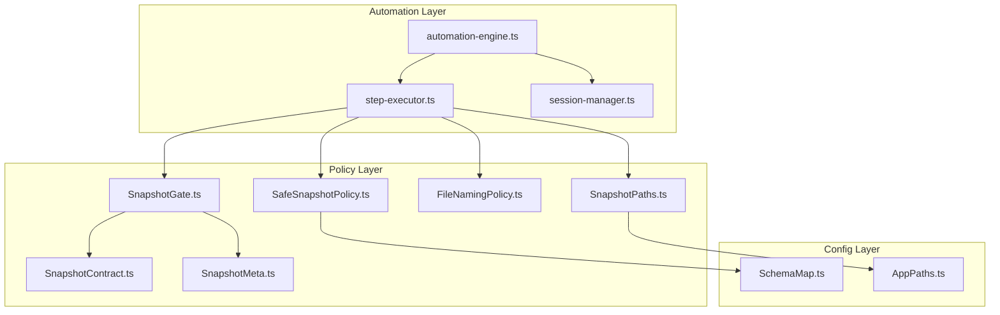
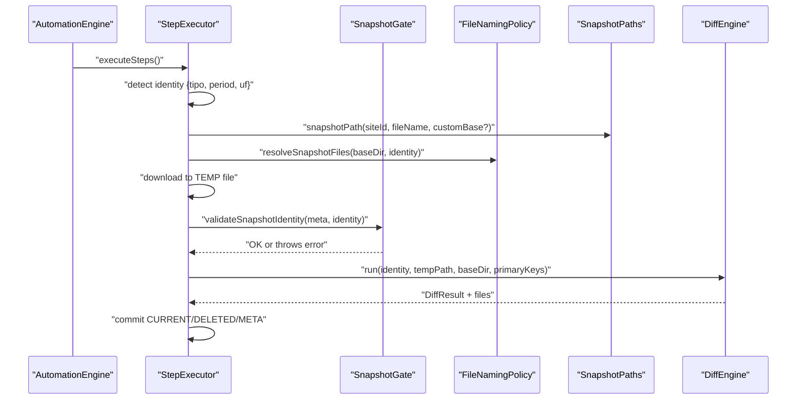
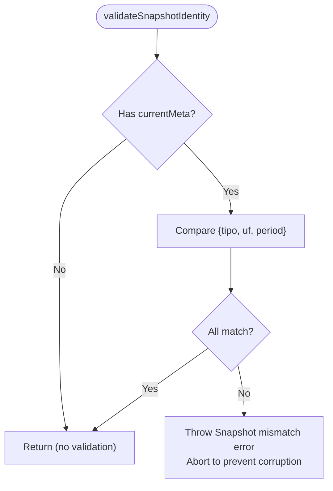
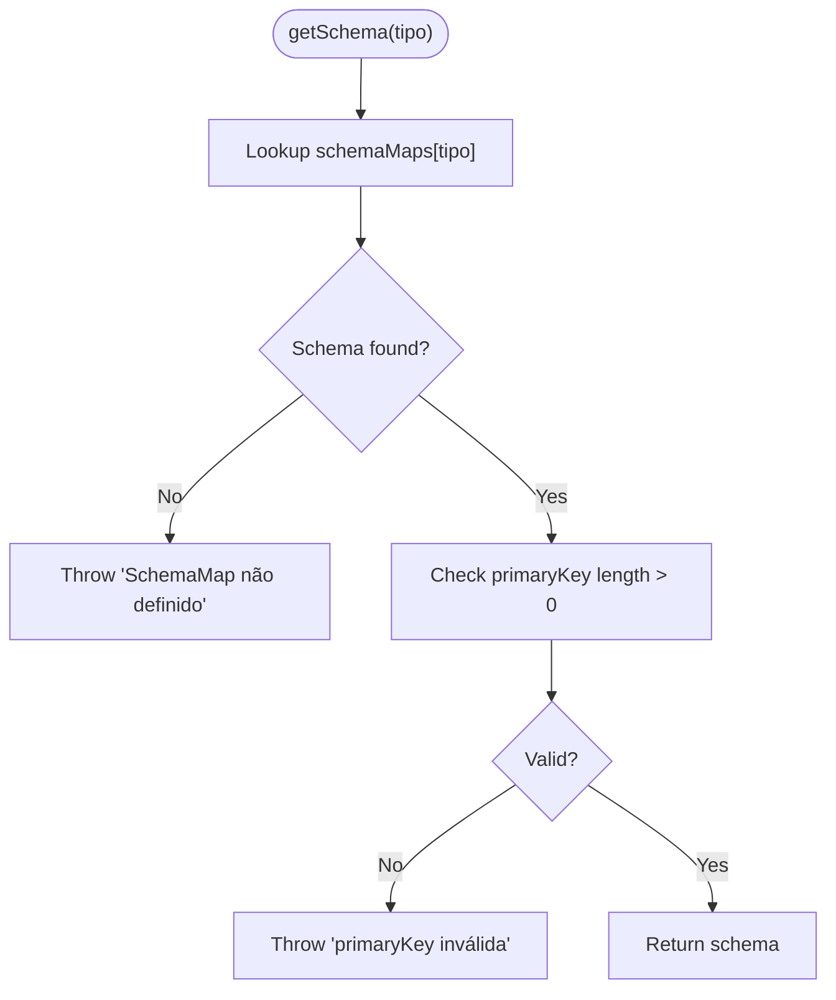
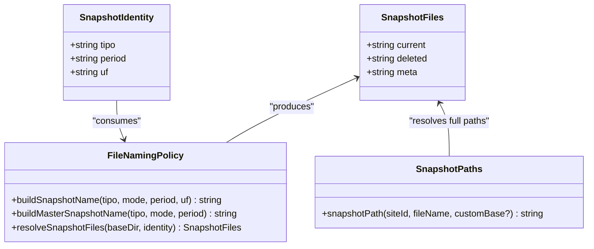
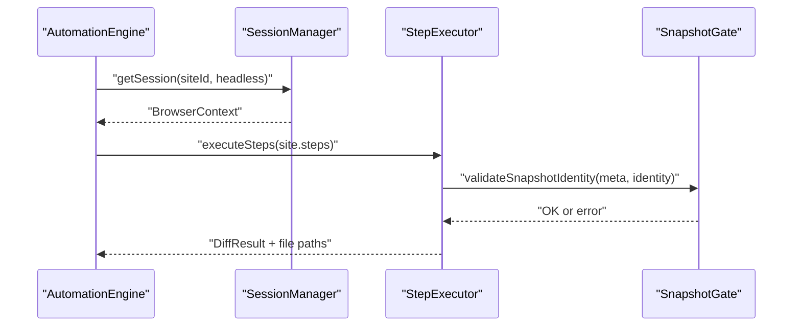
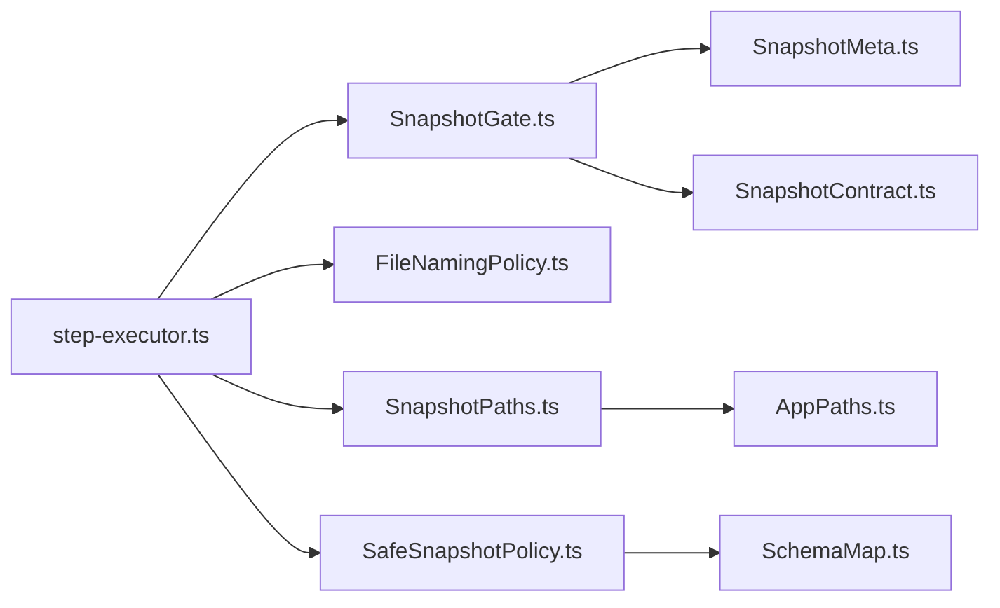

# Snapshot Gate Mechanism

<cite>
**Referenced Files in This Document**
- [SnapshotGate.ts](file://app/policy/snapshot/SnapshotGate.ts)
- [SafeSnapshotPolicy.ts](file://app/policy/snapshot/SafeSnapshotPolicy.ts)
- [SnapshotContract.ts](file://app/policy/snapshot/SnapshotContract.ts)
- [SnapshotMeta.ts](file://app/policy/snapshot/SnapshotMeta.ts)
- [FileNamingPolicy.ts](file://app/policy/snapshot/FileNamingPolicy.ts)
- [SnapshotPaths.ts](file://app/policy/snapshot/SnapshotPaths.ts)
- [SchemaMap.ts](file://app/config/SchemaMap.ts)
- [AppPaths.ts](file://app/core/utils/AppPaths.ts)
- [step-executor.ts](file://app/automation/engine/step-executor.ts)
- [automation-engine.ts](file://app/automation/engine/automation-engine.ts)
- [session-manager.ts](file://app/automation/sessions/session-manager.ts)
</cite>

## Table of Contents
1. [Introduction](#introduction)
2. [Project Structure](#project-structure)
3. [Core Components](#core-components)
4. [Architecture Overview](#architecture-overview)
5. [Detailed Component Analysis](#detailed-component-analysis)
6. [Dependency Analysis](#dependency-analysis)
7. [Performance Considerations](#performance-considerations)
8. [Troubleshooting Guide](#troubleshooting-guide)
9. [Conclusion](#conclusion)

## Introduction
This document explains the Snapshot Gate mechanism within the Snapshot Safety Policy (SSP) framework. The Snapshot Gate acts as a strict access control and validation barrier that prevents accidental or malicious comparison of incompatible snapshots. It enforces identity-based security boundaries across three pillars:
- Identity validation: Ensures snapshots belong to the same {tipo, period, UF} combination
- Schema enforcement: Requires a valid SchemaMap for typed reports
- File naming and storage policies: Guarantees deterministic file naming and secure storage paths

The gate integrates tightly with the automation engine, session management, and diff engine to maintain consistency, prevent corruption, and support enterprise-grade auditability.

## Project Structure
The Snapshot Gate resides in the policy/snapshot module alongside supporting contracts, policies, and utilities. It interacts with the automation engine during the download and diff phases, and with session management for browser context persistence.

**Diagram sources**
- [SnapshotGate.ts](file://app/policy/snapshot/SnapshotGate.ts#L1-L28)
- [SafeSnapshotPolicy.ts](file://app/policy/snapshot/SafeSnapshotPolicy.ts#L1-L25)
- [SnapshotContract.ts](file://app/policy/snapshot/SnapshotContract.ts#L1-L20)
- [SnapshotMeta.ts](file://app/policy/snapshot/SnapshotMeta.ts#L1-L18)
- [FileNamingPolicy.ts](file://app/policy/snapshot/FileNamingPolicy.ts#L1-L35)
- [SnapshotPaths.ts](file://app/policy/snapshot/SnapshotPaths.ts#L1-L13)
- [SchemaMap.ts](file://app/config/SchemaMap.ts#L1-L13)
- [AppPaths.ts](file://app/core/utils/AppPaths.ts#L1-L60)
- [step-executor.ts](file://app/automation/engine/step-executor.ts#L1-L549)
- [automation-engine.ts](file://app/automation/engine/automation-engine.ts#L1-L611)
- [session-manager.ts](file://app/automation/sessions/session-manager.ts#L1-L225)

**Section sources**
- [SnapshotGate.ts](file://app/policy/snapshot/SnapshotGate.ts#L1-L28)
- [SafeSnapshotPolicy.ts](file://app/policy/snapshot/SafeSnapshotPolicy.ts#L1-L25)
- [SnapshotContract.ts](file://app/policy/snapshot/SnapshotContract.ts#L1-L20)
- [SnapshotMeta.ts](file://app/policy/snapshot/SnapshotMeta.ts#L1-L18)
- [FileNamingPolicy.ts](file://app/policy/snapshot/FileNamingPolicy.ts#L1-L35)
- [SnapshotPaths.ts](file://app/policy/snapshot/SnapshotPaths.ts#L1-L13)
- [SchemaMap.ts](file://app/config/SchemaMap.ts#L1-L13)
- [AppPaths.ts](file://app/core/utils/AppPaths.ts#L1-L60)
- [step-executor.ts](file://app/automation/engine/step-executor.ts#L1-L549)
- [automation-engine.ts](file://app/automation/engine/automation-engine.ts#L1-L611)
- [session-manager.ts](file://app/automation/sessions/session-manager.ts#L1-L225)

## Core Components
- SnapshotGate: Validates that a new snapshot identity matches the existing snapshot metadata to prevent cross-period comparisons.
- SafeSnapshotPolicy: Enforces schema validity for typed reports and throws explicit errors when schema configuration is missing or invalid.
- SnapshotContract: Defines the universal snapshot identity model {tipo, period, uf} and file contract shapes.
- SnapshotMeta: Stores the immutable identity and operational metadata for snapshot governance.
- FileNamingPolicy: Provides deterministic naming for CURRENT, DELETED, and META files.
- SnapshotPaths: Resolves secure storage paths under the application data directory.
- SchemaMap: User-defined mapping of report types to primary keys and optional fields for diffing.
- AppPaths: Centralizes path resolution for snapshots and other persistent data.

**Section sources**
- [SnapshotGate.ts](file://app/policy/snapshot/SnapshotGate.ts#L1-L28)
- [SafeSnapshotPolicy.ts](file://app/policy/snapshot/SafeSnapshotPolicy.ts#L1-L25)
- [SnapshotContract.ts](file://app/policy/snapshot/SnapshotContract.ts#L1-L20)
- [SnapshotMeta.ts](file://app/policy/snapshot/SnapshotMeta.ts#L1-L18)
- [FileNamingPolicy.ts](file://app/policy/snapshot/FileNamingPolicy.ts#L1-L35)
- [SnapshotPaths.ts](file://app/policy/snapshot/SnapshotPaths.ts#L1-L13)
- [SchemaMap.ts](file://app/config/SchemaMap.ts#L1-L13)
- [AppPaths.ts](file://app/core/utils/AppPaths.ts#L1-L60)

## Architecture Overview
The Snapshot Gate operates as a mandatory precondition in the snapshot lifecycle. During the download step, the automation engine:
1. Builds a snapshot identity from the current site configuration and detected period
2. Resolves file paths using deterministic naming
3. Downloads the new snapshot to a temporary location
4. Executes the Snapshot Gate to validate identity against existing metadata
5. Runs the diff engine to produce CURRENT, DELETED, and META artifacts
6. Updates the META file atomically

**Diagram sources**
- [step-executor.ts](file://app/automation/engine/step-executor.ts#L440-L488)
- [SnapshotGate.ts](file://app/policy/snapshot/SnapshotGate.ts#L4-L27)
- [FileNamingPolicy.ts](file://app/policy/snapshot/FileNamingPolicy.ts#L23-L34)
- [SnapshotPaths.ts](file://app/policy/snapshot/SnapshotPaths.ts#L8-L12)

**Section sources**
- [step-executor.ts](file://app/automation/engine/step-executor.ts#L440-L488)
- [SnapshotGate.ts](file://app/policy/snapshot/SnapshotGate.ts#L4-L27)
- [FileNamingPolicy.ts](file://app/policy/snapshot/FileNamingPolicy.ts#L23-L34)
- [SnapshotPaths.ts](file://app/policy/snapshot/SnapshotPaths.ts#L8-L12)

## Detailed Component Analysis

### Snapshot Gate Validation Logic
The gate enforces identity consistency by comparing the incoming snapshot identity with the stored metadata. It throws a descriptive error if any component of the identity mismatches, preventing cross-period or cross-region comparisons.

**Diagram sources**
- [SnapshotGate.ts](file://app/policy/snapshot/SnapshotGate.ts#L4-L27)

**Section sources**
- [SnapshotGate.ts](file://app/policy/snapshot/SnapshotGate.ts#L4-L27)

### Safe Snapshot Policy Enforcement
The policy ensures typed reports (with reportType) cannot proceed without a valid SchemaMap and primary keys. It validates:
- Presence of the schema for the given tipo
- Non-empty primary key array

**Diagram sources**
- [SafeSnapshotPolicy.ts](file://app/policy/snapshot/SafeSnapshotPolicy.ts#L8-L23)
- [SchemaMap.ts](file://app/config/SchemaMap.ts#L1-L13)

**Section sources**
- [SafeSnapshotPolicy.ts](file://app/policy/snapshot/SafeSnapshotPolicy.ts#L8-L23)
- [SchemaMap.ts](file://app/config/SchemaMap.ts#L1-L13)

### Snapshot Identity and File Naming
The identity model defines the immutable triplet {tipo, period, uf}, while file naming produces deterministic paths for CURRENT, DELETED, and META files. Storage paths are resolved under the application data directory for safety and portability.

**Diagram sources**
- [SnapshotContract.ts](file://app/policy/snapshot/SnapshotContract.ts#L9-L19)
- [FileNamingPolicy.ts](file://app/policy/snapshot/FileNamingPolicy.ts#L4-L34)
- [SnapshotPaths.ts](file://app/policy/snapshot/SnapshotPaths.ts#L8-L12)

**Section sources**
- [SnapshotContract.ts](file://app/policy/snapshot/SnapshotContract.ts#L9-L19)
- [FileNamingPolicy.ts](file://app/policy/snapshot/FileNamingPolicy.ts#L4-L34)
- [SnapshotPaths.ts](file://app/policy/snapshot/SnapshotPaths.ts#L8-L12)
- [AppPaths.ts](file://app/core/utils/AppPaths.ts#L37-L39)

### Integration with Automation Engine and Sessions
The automation engine orchestrates session management and invokes the step executor, which performs the Snapshot Gate validation and diff operations. Session persistence ensures continuity across runs while maintaining separate contexts per site.

**Diagram sources**
- [automation-engine.ts](file://app/automation/engine/automation-engine.ts#L290-L390)
- [session-manager.ts](file://app/automation/sessions/session-manager.ts#L103-L138)
- [step-executor.ts](file://app/automation/engine/step-executor.ts#L440-L488)
- [SnapshotGate.ts](file://app/policy/snapshot/SnapshotGate.ts#L4-L27)

**Section sources**
- [automation-engine.ts](file://app/automation/engine/automation-engine.ts#L290-L390)
- [session-manager.ts](file://app/automation/sessions/session-manager.ts#L103-L138)
- [step-executor.ts](file://app/automation/engine/step-executor.ts#L440-L488)
- [SnapshotGate.ts](file://app/policy/snapshot/SnapshotGate.ts#L4-L27)

## Dependency Analysis
The Snapshot Gate depends on:
- SnapshotMeta for current identity
- SnapshotContract for identity shape
- FileNamingPolicy and SnapshotPaths for deterministic file resolution
- SafeSnapshotPolicy for schema validation (when reportType is present)
- AppPaths for secure storage locations

**Diagram sources**
- [SnapshotGate.ts](file://app/policy/snapshot/SnapshotGate.ts#L1-L2)
- [SnapshotMeta.ts](file://app/policy/snapshot/SnapshotMeta.ts#L1-L18)
- [SnapshotContract.ts](file://app/policy/snapshot/SnapshotContract.ts#L1-L20)
- [step-executor.ts](file://app/automation/engine/step-executor.ts#L8-L11)
- [FileNamingPolicy.ts](file://app/policy/snapshot/FileNamingPolicy.ts#L1-L2)
- [SnapshotPaths.ts](file://app/policy/snapshot/SnapshotPaths.ts#L1-L2)
- [SafeSnapshotPolicy.ts](file://app/policy/snapshot/SafeSnapshotPolicy.ts#L1-L6)
- [SchemaMap.ts](file://app/config/SchemaMap.ts#L1-L13)
- [AppPaths.ts](file://app/core/utils/AppPaths.ts#L1-L2)

**Section sources**
- [SnapshotGate.ts](file://app/policy/snapshot/SnapshotGate.ts#L1-L2)
- [SnapshotMeta.ts](file://app/policy/snapshot/SnapshotMeta.ts#L1-L18)
- [SnapshotContract.ts](file://app/policy/snapshot/SnapshotContract.ts#L1-L20)
- [step-executor.ts](file://app/automation/engine/step-executor.ts#L8-L11)
- [FileNamingPolicy.ts](file://app/policy/snapshot/FileNamingPolicy.ts#L1-L2)
- [SnapshotPaths.ts](file://app/policy/snapshot/SnapshotPaths.ts#L1-L2)
- [SafeSnapshotPolicy.ts](file://app/policy/snapshot/SafeSnapshotPolicy.ts#L1-L6)
- [SchemaMap.ts](file://app/config/SchemaMap.ts#L1-L13)
- [AppPaths.ts](file://app/core/utils/AppPaths.ts#L1-L2)

## Performance Considerations
- Identity validation is O(1) and lightweight, adding negligible overhead
- Deterministic file naming avoids filesystem traversal costs
- Temporary file usage during download minimizes risk of partial writes
- Schema lookup is O(1) via dictionary access
- Snapshot paths are resolved once per execution cycle

## Troubleshooting Guide
Common issues and resolutions:
- Snapshot mismatch error: Indicates a period or region mismatch. Verify the selected period and region in the site configuration and ensure the correct preset is applied.
- SchemaMap not defined: Ensure the report type exists in the schema configuration and that primary keys are defined for typed reports.
- Missing primaryKey: Add the required primary key columns for the report type to enable diff operations.
- Path creation failures: Confirm the application data directory is writable and that AppPaths.ensureDirectories has been executed.
- Session-related failures: Close active sessions and retry; ensure the browser profile is not locked by another process.

**Section sources**
- [SnapshotGate.ts](file://app/policy/snapshot/SnapshotGate.ts#L15-L26)
- [SafeSnapshotPolicy.ts](file://app/policy/snapshot/SafeSnapshotPolicy.ts#L10-L20)
- [AppPaths.ts](file://app/core/utils/AppPaths.ts#L44-L58)
- [session-manager.ts](file://app/automation/sessions/session-manager.ts#L155-L165)

## Conclusion
The Snapshot Gate is a critical security control that enforces identity consistency and prevents cross-period or cross-region snapshot comparisons. Combined with SafeSnapshotPolicy, deterministic file naming, and secure storage paths, it establishes a robust foundation for safe, auditable snapshot diffing. Proper configuration of schemas and identities, along with reliable session management, ensures the system remains secure and resilient.