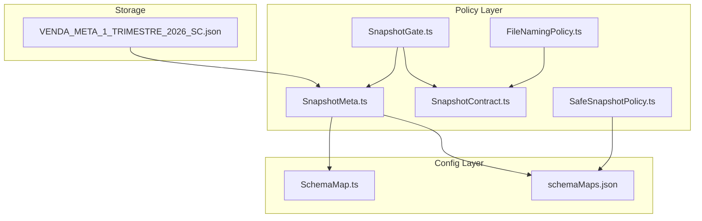
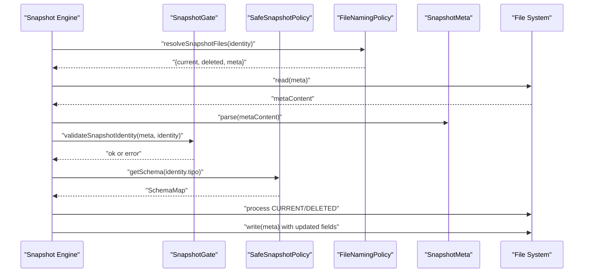
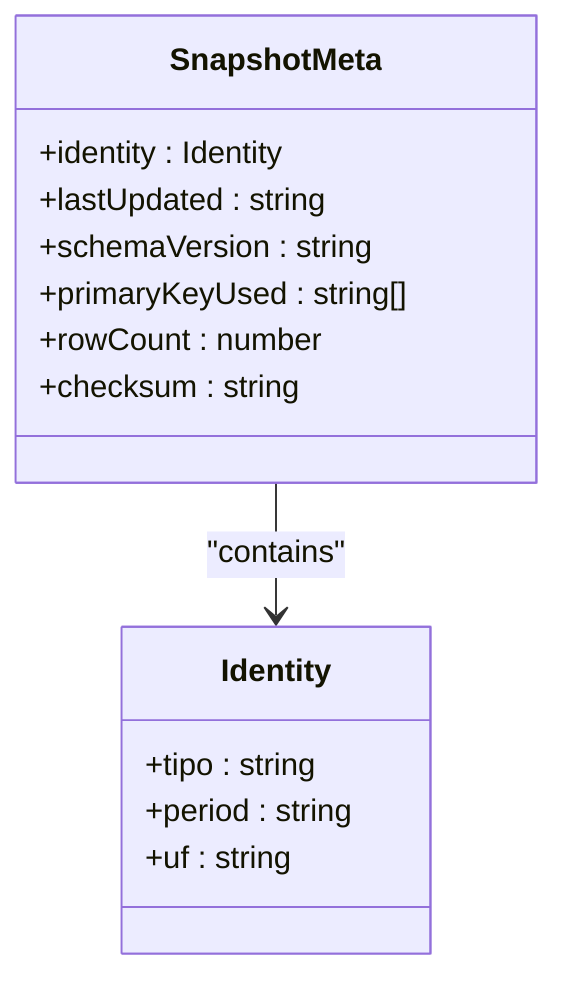
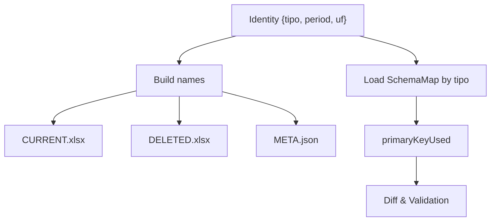
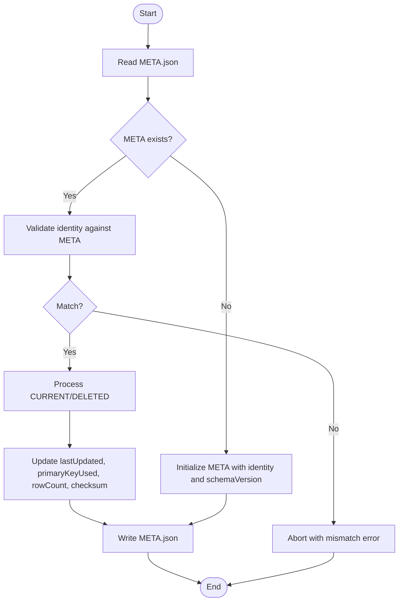
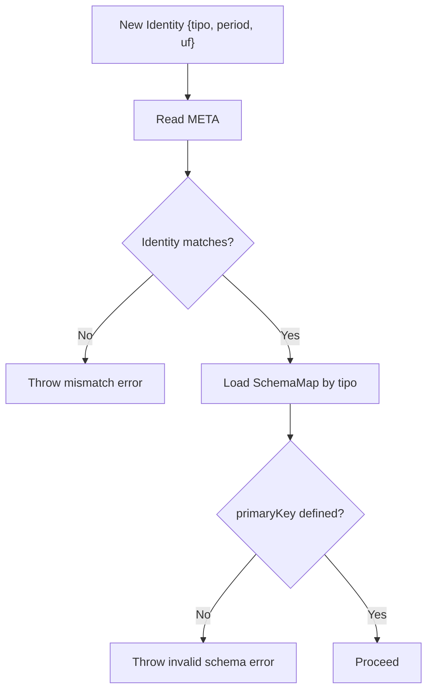
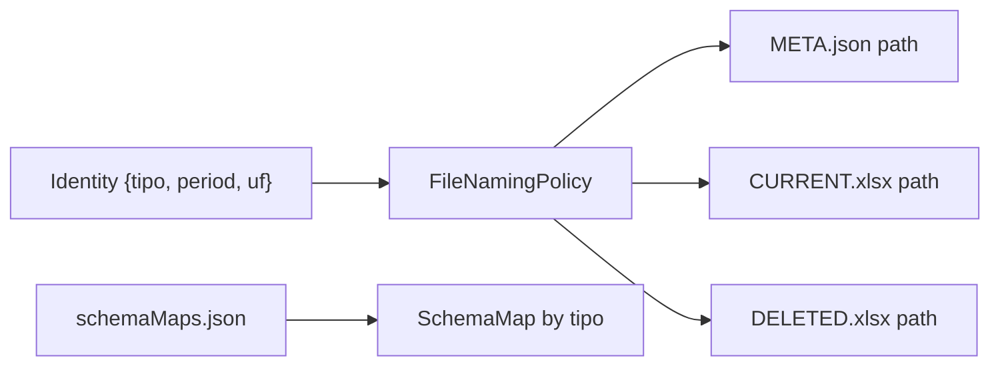
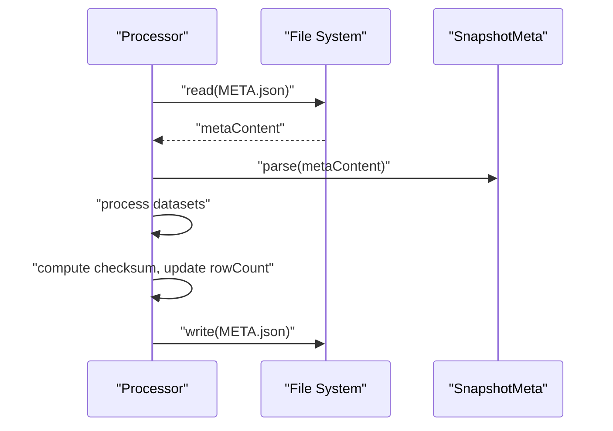
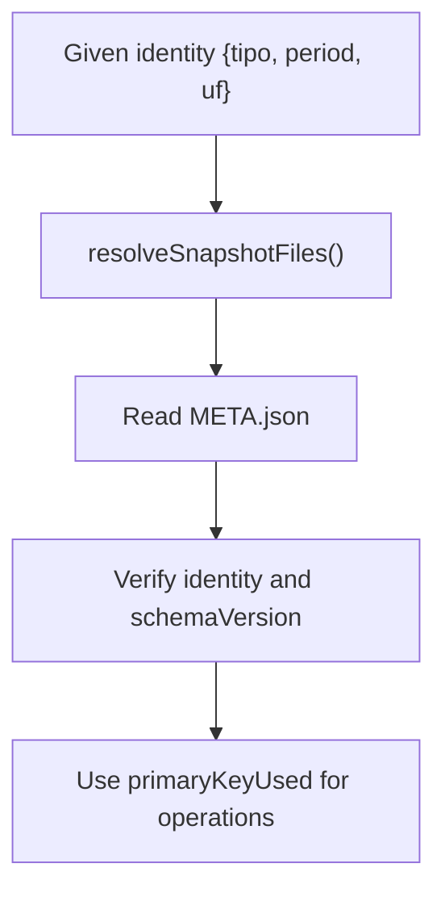
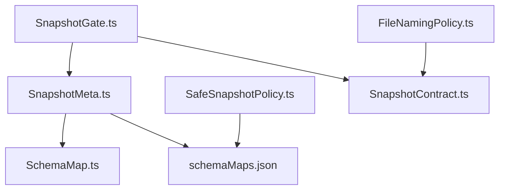

# Snapshot Metadata Management

<cite>
**Referenced Files in This Document**
- [SnapshotMeta.ts](file://app/policy/snapshot/SnapshotMeta.ts)
- [SnapshotContract.ts](file://app/policy/snapshot/SnapshotContract.ts)
- [SafeSnapshotPolicy.ts](file://app/policy/snapshot/SafeSnapshotPolicy.ts)
- [SnapshotGate.ts](file://app/policy/snapshot/SnapshotGate.ts)
- [FileNamingPolicy.ts](file://app/policy/snapshot/FileNamingPolicy.ts)
- [SchemaMap.ts](file://app/config/SchemaMap.ts)
- [schemaMaps.json](file://data/schemaMaps.json)
- [VENDA_META_1_TRIMESTRE_2026_SC.json](file://snapshots/site-1769612315557/VENDA_META_1_TRIMESTRE_2026_SC.json)
</cite>

## Table of Contents
1. [Introduction](#introduction)
2. [Project Structure](#project-structure)
3. [Core Components](#core-components)
4. [Architecture Overview](#architecture-overview)
5. [Detailed Component Analysis](#detailed-component-analysis)
6. [Dependency Analysis](#dependency-analysis)
7. [Performance Considerations](#performance-considerations)
8. [Troubleshooting Guide](#troubleshooting-guide)
9. [Conclusion](#conclusion)
10. [Appendices](#appendices)

## Introduction
This document describes Snapshot Metadata Management within the Snapshot Safety Policy (SSP) framework. It explains the metadata schema design, data structure organization, and lifecycle management of snapshot metadata. It documents the metadata fields, validation rules, storage mechanisms, and operational patterns for updates and retrievals. It also clarifies the relationship between metadata and snapshot identification, audit trails, and compliance reporting, and provides guidelines for extending metadata schemas and maintaining consistency across snapshot operations.

## Project Structure
The snapshot metadata system is organized around a small set of focused modules under the policy/snapshot directory, with configuration managed via JSON schema maps and stored alongside snapshots.

**Diagram sources**
- [SnapshotMeta.ts](file://app/policy/snapshot/SnapshotMeta.ts#L1-L18)
- [SnapshotContract.ts](file://app/policy/snapshot/SnapshotContract.ts#L1-L20)
- [SafeSnapshotPolicy.ts](file://app/policy/snapshot/SafeSnapshotPolicy.ts#L1-L25)
- [SnapshotGate.ts](file://app/policy/snapshot/SnapshotGate.ts#L1-L28)
- [FileNamingPolicy.ts](file://app/policy/snapshot/FileNamingPolicy.ts#L1-L35)
- [SchemaMap.ts](file://app/config/SchemaMap.ts#L1-L13)
- [schemaMaps.json](file://data/schemaMaps.json#L1-L9)
- [VENDA_META_1_TRIMESTRE_2026_SC.json](file://snapshots/site-1769612315557/VENDA_META_1_TRIMESTRE_2026_SC.json#L1-L16)

**Section sources**
- [SnapshotMeta.ts](file://app/policy/snapshot/SnapshotMeta.ts#L1-L18)
- [SnapshotContract.ts](file://app/policy/snapshot/SnapshotContract.ts#L1-L20)
- [SafeSnapshotPolicy.ts](file://app/policy/snapshot/SafeSnapshotPolicy.ts#L1-L25)
- [SnapshotGate.ts](file://app/policy/snapshot/SnapshotGate.ts#L1-L28)
- [FileNamingPolicy.ts](file://app/policy/snapshot/FileNamingPolicy.ts#L1-L35)
- [SchemaMap.ts](file://app/config/SchemaMap.ts#L1-L13)
- [schemaMaps.json](file://data/schemaMaps.json#L1-L9)
- [VENDA_META_1_TRIMESTRE_2026_SC.json](file://snapshots/site-1769612315557/VENDA_META_1_TRIMESTRE_2026_SC.json#L1-L16)

## Core Components
- SnapshotMeta: Defines the metadata structure persisted per snapshot.
- SnapshotContract: Provides identity and file naming contracts.
- SafeSnapshotPolicy: Enforces schema validity and primary key requirements.
- SnapshotGate: Validates snapshot identity consistency against existing metadata.
- FileNamingPolicy: Generates deterministic file paths for current/deleted/meta artifacts.
- SchemaMap and schemaMaps.json: Define per-type primary keys and optional comparison fields.

**Section sources**
- [SnapshotMeta.ts](file://app/policy/snapshot/SnapshotMeta.ts#L1-L18)
- [SnapshotContract.ts](file://app/policy/snapshot/SnapshotContract.ts#L1-L20)
- [SafeSnapshotPolicy.ts](file://app/policy/snapshot/SafeSnapshotPolicy.ts#L1-L25)
- [SnapshotGate.ts](file://app/policy/snapshot/SnapshotGate.ts#L1-L28)
- [FileNamingPolicy.ts](file://app/policy/snapshot/FileNamingPolicy.ts#L1-L35)
- [SchemaMap.ts](file://app/config/SchemaMap.ts#L1-L13)
- [schemaMaps.json](file://data/schemaMaps.json#L1-L9)

## Architecture Overview
The metadata lifecycle centers on three files per snapshot identity: CURRENT (xlsx), DELETED (xlsx), and META (json). The META file acts as a guardian, containing identity, timestamps, schema version, primary key used, row count, and checksum. Operations must validate identity against META before proceeding, and must update META after successful processing.

**Diagram sources**
- [SnapshotGate.ts](file://app/policy/snapshot/SnapshotGate.ts#L1-L28)
- [SafeSnapshotPolicy.ts](file://app/policy/snapshot/SafeSnapshotPolicy.ts#L1-L25)
- [FileNamingPolicy.ts](file://app/policy/snapshot/FileNamingPolicy.ts#L1-L35)
- [SnapshotMeta.ts](file://app/policy/snapshot/SnapshotMeta.ts#L1-L18)
- [VENDA_META_1_TRIMESTRE_2026_SC.json](file://snapshots/site-1769612315557/VENDA_META_1_TRIMESTRE_2026_SC.json#L1-L16)

## Detailed Component Analysis

### Metadata Schema Design
The metadata schema defines a compact, versioned record that ties a snapshot to its identity and operational state. It includes:
- Identity: type, period, and geographic unit (uf)
- lastUpdated: ISO timestamp of last update
- schemaVersion: version string for the schema used
- primaryKeyUsed: array of primary key column names applied
- rowCount: number of rows captured
- checksum: cryptographic digest of the dataset

**Diagram sources**
- [SnapshotMeta.ts](file://app/policy/snapshot/SnapshotMeta.ts#L1-L18)

**Section sources**
- [SnapshotMeta.ts](file://app/policy/snapshot/SnapshotMeta.ts#L1-L18)
- [VENDA_META_1_TRIMESTRE_2026_SC.json](file://snapshots/site-1769612315557/VENDA_META_1_TRIMESTRE_2026_SC.json#L1-L16)

### Data Structure Organization
- Per-identity files: CURRENT.xlsx, DELETED.xlsx, META.json
- Deterministic naming: based on tipo, period, and uf
- Centralized schema maps: per-type primary keys and optional compare fields

**Diagram sources**
- [FileNamingPolicy.ts](file://app/policy/snapshot/FileNamingPolicy.ts#L1-L35)
- [schemaMaps.json](file://data/schemaMaps.json#L1-L9)

**Section sources**
- [FileNamingPolicy.ts](file://app/policy/snapshot/FileNamingPolicy.ts#L1-L35)
- [schemaMaps.json](file://data/schemaMaps.json#L1-L9)

### Metadata Lifecycle Management
- Creation: On first snapshot generation, write META with initial identity, schemaVersion, primaryKeyUsed, rowCount=0, checksum empty
- Update: After processing CURRENT/DELETED, update lastUpdated, schemaVersion, primaryKeyUsed, rowCount, and compute/assign checksum
- Validation: Before any operation, read META and validate identity fields match the requested identity; abort if mismatch
- Deletion: Maintain DELETED artifact and update META accordingly

**Diagram sources**
- [SnapshotGate.ts](file://app/policy/snapshot/SnapshotGate.ts#L1-L28)
- [SnapshotMeta.ts](file://app/policy/snapshot/SnapshotMeta.ts#L1-L18)

**Section sources**
- [SnapshotGate.ts](file://app/policy/snapshot/SnapshotGate.ts#L1-L28)
- [SnapshotMeta.ts](file://app/policy/snapshot/SnapshotMeta.ts#L1-L18)
- [VENDA_META_1_TRIMESTRE_2026_SC.json](file://snapshots/site-1769612315557/VENDA_META_1_TRIMESTRE_2026_SC.json#L1-L16)

### Validation Rules
- Identity integrity: tipo, period, and uf must match between requested identity and existing META
- Schema presence: a SchemaMap must exist for tipo and must define a non-empty primaryKey
- File naming: deterministic naming ensures consistent lookup and prevents cross-period contamination

**Diagram sources**
- [SnapshotGate.ts](file://app/policy/snapshot/SnapshotGate.ts#L1-L28)
- [SafeSnapshotPolicy.ts](file://app/policy/snapshot/SafeSnapshotPolicy.ts#L1-L25)

**Section sources**
- [SnapshotGate.ts](file://app/policy/snapshot/SnapshotGate.ts#L1-L28)
- [SafeSnapshotPolicy.ts](file://app/policy/snapshot/SafeSnapshotPolicy.ts#L1-L25)

### Storage Mechanisms
- META is stored as a JSON file named with the pattern: "<tipo>_META_<period>_<uf>.json"
- CURRENT and DELETED are Excel files with deterministic names
- SchemaMaps are loaded from a JSON file keyed by tipo

**Diagram sources**
- [FileNamingPolicy.ts](file://app/policy/snapshot/FileNamingPolicy.ts#L1-L35)
- [schemaMaps.json](file://data/schemaMaps.json#L1-L9)

**Section sources**
- [FileNamingPolicy.ts](file://app/policy/snapshot/FileNamingPolicy.ts#L1-L35)
- [schemaMaps.json](file://data/schemaMaps.json#L1-L9)

### Examples of Metadata Content
A real-world example demonstrates the identity, timestamps, schema version, primary key used, row count, and checksum fields.

- Example path: [VENDA_META_1_TRIMESTRE_2026_SC.json](file://snapshots/site-1769612315557/VENDA_META_1_TRIMESTRE_2026_SC.json#L1-L16)

**Section sources**
- [VENDA_META_1_TRIMESTRE_2026_SC.json](file://snapshots/site-1769612315557/VENDA_META_1_TRIMESTRE_2026_SC.json#L1-L16)

### Update Procedures
- Read existing META
- Validate identity
- Load SchemaMap for tipo
- Process CURRENT and DELETED datasets
- Compute checksum and update rowCount
- Write updated META

**Diagram sources**
- [SnapshotMeta.ts](file://app/policy/snapshot/SnapshotMeta.ts#L1-L18)
- [VENDA_META_1_TRIMESTRE_2026_SC.json](file://snapshots/site-1769612315557/VENDA_META_1_TRIMESTRE_2026_SC.json#L1-L16)

**Section sources**
- [SnapshotMeta.ts](file://app/policy/snapshot/SnapshotMeta.ts#L1-L18)
- [VENDA_META_1_TRIMESTRE_2026_SC.json](file://snapshots/site-1769612315557/VENDA_META_1_TRIMESTRE_2026_SC.json#L1-L16)

### Retrieval Patterns
- Resolve file paths using identity and naming policy
- Read META to confirm identity and schema version
- Use primaryKeyUsed for downstream diff and validation steps

**Diagram sources**
- [FileNamingPolicy.ts](file://app/policy/snapshot/FileNamingPolicy.ts#L1-L35)
- [SnapshotMeta.ts](file://app/policy/snapshot/SnapshotMeta.ts#L1-L18)

**Section sources**
- [FileNamingPolicy.ts](file://app/policy/snapshot/FileNamingPolicy.ts#L1-L35)
- [SnapshotMeta.ts](file://app/policy/snapshot/SnapshotMeta.ts#L1-L18)

### Relationship to Snapshot Identification, Audit Trails, and Compliance Reporting
- Snapshot identification: META anchors tipo, period, and uf to ensure consistent and verifiable snapshot identity.
- Audit trails: lastUpdated provides a timestamp for each update; checksum enables immutable verification of dataset integrity.
- Compliance reporting: schemaVersion and primaryKeyUsed enable auditors to verify adherence to governance policies and schema evolution.

**Section sources**
- [SnapshotMeta.ts](file://app/policy/snapshot/SnapshotMeta.ts#L1-L18)
- [VENDA_META_1_TRIMESTRE_2026_SC.json](file://snapshots/site-1769612315557/VENDA_META_1_TRIMESTRE_2026_SC.json#L1-L16)

### Guidelines for Extending Metadata Schemas and Managing Consistency
- Extend SnapshotMeta carefully: add optional fields with defaults and ensure backward compatibility.
- Maintain schemaVersions: increment schemaVersion when metadata structure changes.
- Enforce identity gates: always validate identity before processing to prevent cross-period contamination.
- Keep primaryKeyUsed synchronized: update primaryKeyUsed whenever primary key composition changes.
- Use deterministic naming: rely on FileNamingPolicy to avoid ambiguous file paths.
- Centralize schema maps: manage SchemaMap entries per tipo in schemaMaps.json to enforce primary key rules.

**Section sources**
- [SnapshotMeta.ts](file://app/policy/snapshot/SnapshotMeta.ts#L1-L18)
- [SafeSnapshotPolicy.ts](file://app/policy/snapshot/SafeSnapshotPolicy.ts#L1-L25)
- [FileNamingPolicy.ts](file://app/policy/snapshot/FileNamingPolicy.ts#L1-L35)
- [schemaMaps.json](file://data/schemaMaps.json#L1-L9)

## Dependency Analysis
The following diagram shows how components depend on each other and on configuration.

**Diagram sources**
- [SnapshotMeta.ts](file://app/policy/snapshot/SnapshotMeta.ts#L1-L18)
- [SchemaMap.ts](file://app/config/SchemaMap.ts#L1-L13)
- [schemaMaps.json](file://data/schemaMaps.json#L1-L9)
- [SafeSnapshotPolicy.ts](file://app/policy/snapshot/SafeSnapshotPolicy.ts#L1-L25)
- [SnapshotGate.ts](file://app/policy/snapshot/SnapshotGate.ts#L1-L28)
- [SnapshotContract.ts](file://app/policy/snapshot/SnapshotContract.ts#L1-L20)
- [FileNamingPolicy.ts](file://app/policy/snapshot/FileNamingPolicy.ts#L1-L35)

**Section sources**
- [SnapshotMeta.ts](file://app/policy/snapshot/SnapshotMeta.ts#L1-L18)
- [SchemaMap.ts](file://app/config/SchemaMap.ts#L1-L13)
- [schemaMaps.json](file://data/schemaMaps.json#L1-L9)
- [SafeSnapshotPolicy.ts](file://app/policy/snapshot/SafeSnapshotPolicy.ts#L1-L25)
- [SnapshotGate.ts](file://app/policy/snapshot/SnapshotGate.ts#L1-L28)
- [SnapshotContract.ts](file://app/policy/snapshot/SnapshotContract.ts#L1-L20)
- [FileNamingPolicy.ts](file://app/policy/snapshot/FileNamingPolicy.ts#L1-L35)

## Performance Considerations
- Keep META minimal: only essential fields reduce IO overhead.
- Use deterministic naming: avoids expensive directory scans.
- Validate early: identity gate prevents unnecessary processing.
- Batch updates: update META atomically after all dataset writes complete.

## Troubleshooting Guide
Common issues and resolutions:
- Identity mismatch error: Indicates META vs. requested identity mismatch; verify tipo, period, and uf.
- Schema not defined: Ensure tipo exists in schemaMaps.json with a non-empty primaryKey.
- Missing META: Initialize META with correct identity and schemaVersion before processing.
- Cross-period contamination: Rely on SnapshotGate to abort operations with mismatched identities.

**Section sources**
- [SnapshotGate.ts](file://app/policy/snapshot/SnapshotGate.ts#L1-L28)
- [SafeSnapshotPolicy.ts](file://app/policy/snapshot/SafeSnapshotPolicy.ts#L1-L25)

## Conclusion
Snapshot Metadata Management in SSP provides a robust, deterministic mechanism for identifying, validating, and auditing snapshots. By anchoring identity in META, enforcing schema validity, and using deterministic naming, the system ensures consistency and compliance across snapshot operations. Extending the metadata schema should be done carefully with versioning and backward compatibility in mind.

## Appendices

### Appendix A: Metadata Field Reference
- identity.tipo: Report type identifier
- identity.period: Period identifier (e.g., Q1_YYYY)
- identity.uf: Geographic unit
- lastUpdated: ISO timestamp of last update
- schemaVersion: Version of the schema used
- primaryKeyUsed: Array of primary key column names
- rowCount: Number of rows in the dataset
- checksum: Cryptographic digest of the dataset

**Section sources**
- [SnapshotMeta.ts](file://app/policy/snapshot/SnapshotMeta.ts#L1-L18)
- [VENDA_META_1_TRIMESTRE_2026_SC.json](file://snapshots/site-1769612315557/VENDA_META_1_TRIMESTRE_2026_SC.json#L1-L16)