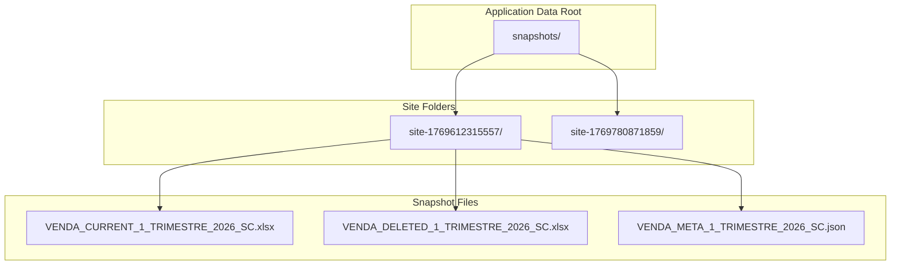
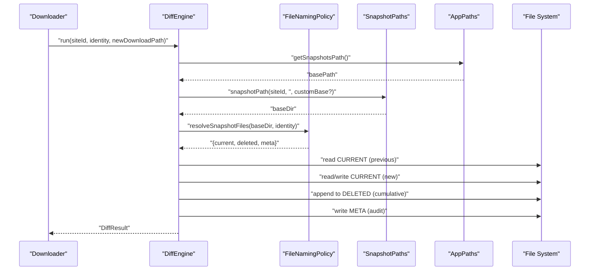
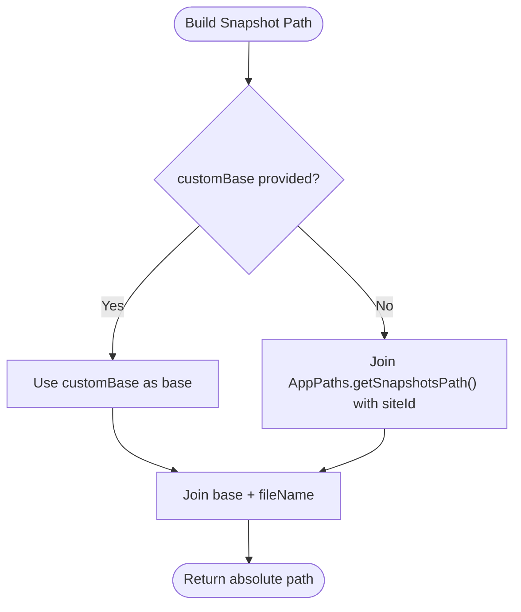
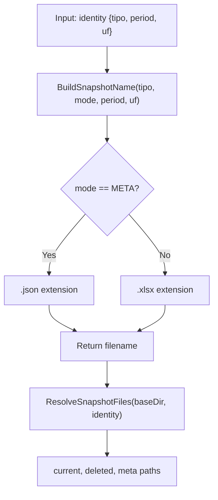
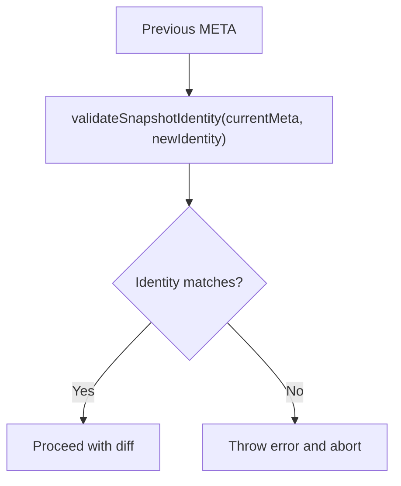
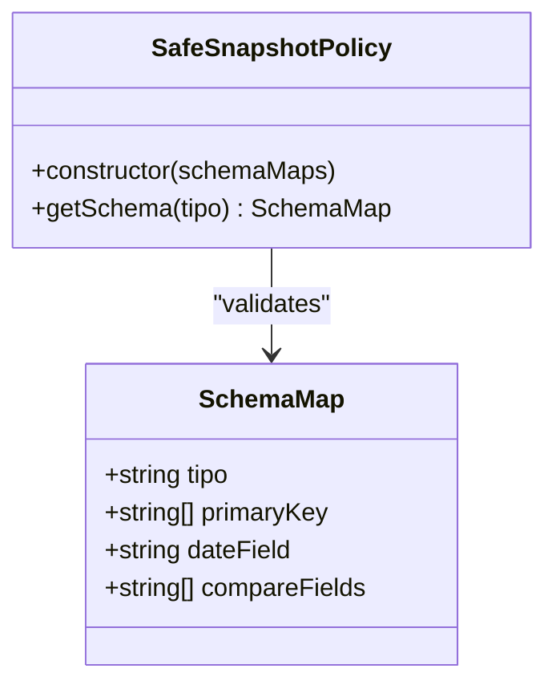
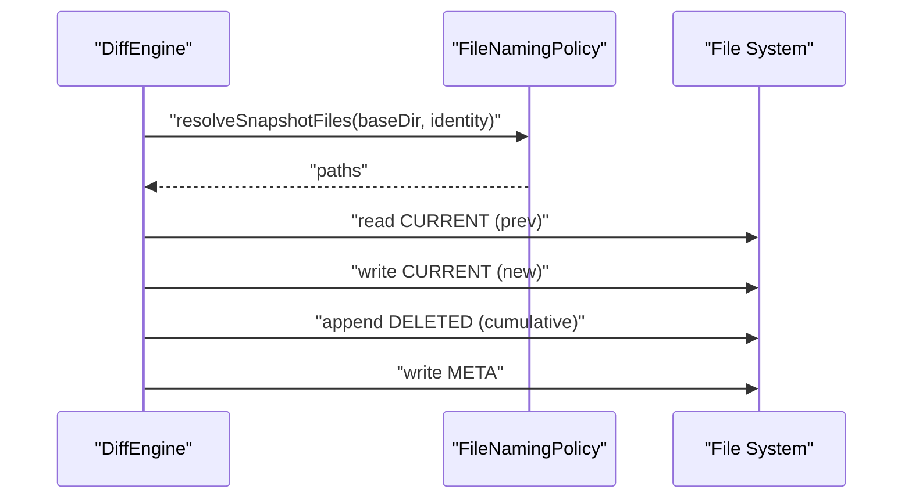
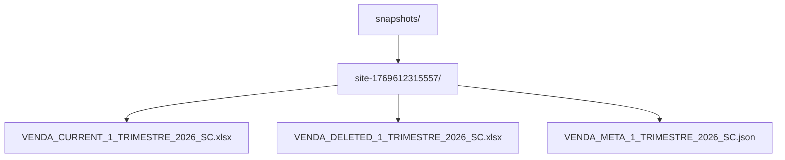
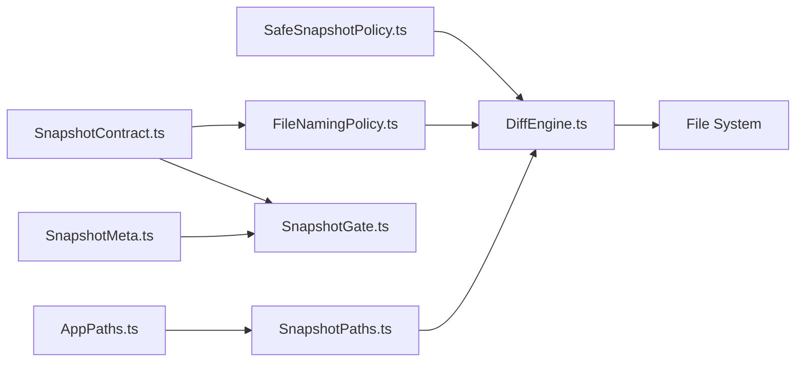

# Snapshot Paths and Organization

<cite>
**Referenced Files in This Document**
- [SnapshotPaths.ts](file://app/policy/snapshot/SnapshotPaths.ts)
- [FileNamingPolicy.ts](file://app/policy/snapshot/FileNamingPolicy.ts)
- [SafeSnapshotPolicy.ts](file://app/policy/snapshot/SafeSnapshotPolicy.ts)
- [SnapshotContract.ts](file://app/policy/snapshot/SnapshotContract.ts)
- [SnapshotMeta.ts](file://app/policy/snapshot/SnapshotMeta.ts)
- [SnapshotGate.ts](file://app/policy/snapshot/SnapshotGate.ts)
- [AppPaths.ts](file://app/core/utils/AppPaths.ts)
- [DiffEngine.ts](file://app/core/diff/DiffEngine.ts)
- [schemaMaps.json](file://data/schemaMaps.json)
- [VENDA_META_1_TRIMESTRE_2026_SC.json](file://snapshots/site-1769612315557/VENDA_META_1_TRIMESTRE_2026_SC.json)
</cite>

## Table of Contents
1. [Introduction](#introduction)
2. [Project Structure](#project-structure)
3. [Core Components](#core-components)
4. [Architecture Overview](#architecture-overview)
5. [Detailed Component Analysis](#detailed-component-analysis)
6. [Dependency Analysis](#dependency-analysis)
7. [Performance Considerations](#performance-considerations)
8. [Troubleshooting Guide](#troubleshooting-guide)
9. [Conclusion](#conclusion)

## Introduction
This document explains the Snapshot Path and Organization system within the Snapshot Policy (SSP) framework. It covers directory structure design, file organization strategies, path construction algorithms, and storage location policies. It also documents integration with file system operations, backup strategies, and data archival procedures, along with guidelines for customizing path structures while maintaining performance and compliance.

## Project Structure
The snapshot system organizes files under a dedicated snapshots directory per site. The base layout follows a strict hierarchy to ensure deterministic naming, safe comparisons, and auditability.

- Base storage location: derived from application paths
- Per-site folder: snapshots/{siteId}/
- Files per snapshot: CURRENT, DELETED, META

**Diagram sources**
- [AppPaths.ts](file://app/core/utils/AppPaths.ts#L37-L39)
- [SnapshotPaths.ts](file://app/policy/snapshot/SnapshotPaths.ts#L8-L11)
- [FileNamingPolicy.ts](file://app/policy/snapshot/FileNamingPolicy.ts#L23-L34)
- [VENDA_META_1_TRIMESTRE_2026_SC.json](file://snapshots/site-1769612315557/VENDA_META_1_TRIMESTRE_2026_SC.json#L1-L16)

**Section sources**
- [AppPaths.ts](file://app/core/utils/AppPaths.ts#L37-L39)
- [SnapshotPaths.ts](file://app/policy/snapshot/SnapshotPaths.ts#L8-L11)
- [FileNamingPolicy.ts](file://app/policy/snapshot/FileNamingPolicy.ts#L23-L34)

## Core Components
This section introduces the core building blocks that define snapshot path management and file organization.

- SnapshotPaths: constructs absolute paths for snapshot files
- FileNamingPolicy: defines deterministic file names and resolves file set locations
- SafeSnapshotPolicy: enforces schema-driven identity and validates primary keys
- SnapshotContract: defines identity and file set contracts
- SnapshotMeta: stores metadata for audit and validation
- SnapshotGate: validates identity consistency across runs
- AppPaths: provides base paths and ensures directories exist
- DiffEngine: orchestrates snapshot lifecycle and writes files

**Section sources**
- [SnapshotPaths.ts](file://app/policy/snapshot/SnapshotPaths.ts#L8-L11)
- [FileNamingPolicy.ts](file://app/policy/snapshot/FileNamingPolicy.ts#L4-L34)
- [SafeSnapshotPolicy.ts](file://app/policy/snapshot/SafeSnapshotPolicy.ts#L3-L24)
- [SnapshotContract.ts](file://app/policy/snapshot/SnapshotContract.ts#L9-L19)
- [SnapshotMeta.ts](file://app/policy/snapshot/SnapshotMeta.ts#L1-L17)
- [SnapshotGate.ts](file://app/policy/snapshot/SnapshotGate.ts#L4-L27)
- [AppPaths.ts](file://app/core/utils/AppPaths.ts#L11-L58)
- [DiffEngine.ts](file://app/core/diff/DiffEngine.ts#L55-L219)

## Architecture Overview
The snapshot architecture enforces a strict identity model and deterministic file naming. The DiffEngine coordinates reading previous/current data, computing differences, and writing updated files.

**Diagram sources**
- [DiffEngine.ts](file://app/core/diff/DiffEngine.ts#L55-L219)
- [FileNamingPolicy.ts](file://app/policy/snapshot/FileNamingPolicy.ts#L23-L34)
- [SnapshotPaths.ts](file://app/policy/snapshot/SnapshotPaths.ts#L8-L11)
- [AppPaths.ts](file://app/core/utils/AppPaths.ts#L37-L39)

## Detailed Component Analysis

### Path Construction and Directory Layout
- Base path derivation: snapshots directory under the application data root
- Per-site folders: snapshots/{siteId}/
- Deterministic file names: {tipo}_{mode}_{period}_{uf}.{ext}
- Optional custom base: allows overriding the default layout for special runs

**Diagram sources**
- [SnapshotPaths.ts](file://app/policy/snapshot/SnapshotPaths.ts#L8-L11)
- [AppPaths.ts](file://app/core/utils/AppPaths.ts#L37-L39)

**Section sources**
- [SnapshotPaths.ts](file://app/policy/snapshot/SnapshotPaths.ts#L8-L11)
- [AppPaths.ts](file://app/core/utils/AppPaths.ts#L37-L39)

### File Naming and Resolution
- Naming policy: {tipo}_{mode}_{period}_{uf}.{ext}
- Modes: CURRENT (.xlsx), DELETED (.xlsx), META (.json)
- Master naming: consolidated exports use a separate pattern
- Resolution: returns absolute paths for the three files given an identity

**Diagram sources**
- [FileNamingPolicy.ts](file://app/policy/snapshot/FileNamingPolicy.ts#L4-L34)

**Section sources**
- [FileNamingPolicy.ts](file://app/policy/snapshot/FileNamingPolicy.ts#L4-L34)

### Identity Validation and Safety Gates
- Identity contract: {tipo, period, uf}
- Gate validation: prevents cross-period or cross-type comparisons
- Meta-guard: ensures consistent identity across runs and enables auditing

**Diagram sources**
- [SnapshotGate.ts](file://app/policy/snapshot/SnapshotGate.ts#L4-L27)
- [SnapshotMeta.ts](file://app/policy/snapshot/SnapshotMeta.ts#L1-L17)
- [SnapshotContract.ts](file://app/policy/snapshot/SnapshotContract.ts#L9-L13)

**Section sources**
- [SnapshotGate.ts](file://app/policy/snapshot/SnapshotGate.ts#L4-L27)
- [SnapshotMeta.ts](file://app/policy/snapshot/SnapshotMeta.ts#L1-L17)
- [SnapshotContract.ts](file://app/policy/snapshot/SnapshotContract.ts#L9-L13)

### Schema-Driven Policies and Compliance
- SafeSnapshotPolicy enforces user-defined primary keys via schemaMaps.json
- Enforces non-empty primary keys and throws on invalid configuration
- DiffEngine loads schemaMaps.json from packaged or development resource paths

**Diagram sources**
- [SafeSnapshotPolicy.ts](file://app/policy/snapshot/SafeSnapshotPolicy.ts#L3-L24)
- [schemaMaps.json](file://data/schemaMaps.json#L1-L9)

**Section sources**
- [SafeSnapshotPolicy.ts](file://app/policy/snapshot/SafeSnapshotPolicy.ts#L3-L24)
- [schemaMaps.json](file://data/schemaMaps.json#L1-L9)

### Lifecycle Orchestration and File Writes
- DiffEngine reads new download, optionally merges with previous CURRENT
- Computes signatures using configured primary keys
- Writes CURRENT, appends to DELETED (cumulative), and updates META
- Uses deterministic naming and path resolution

**Diagram sources**
- [DiffEngine.ts](file://app/core/diff/DiffEngine.ts#L55-L219)
- [FileNamingPolicy.ts](file://app/policy/snapshot/FileNamingPolicy.ts#L23-L34)

**Section sources**
- [DiffEngine.ts](file://app/core/diff/DiffEngine.ts#L55-L219)

### Example Path Layouts and Organizational Patterns
- Typical layout: snapshots/{siteId}/VENDA_CURRENT_...xlsx, VENDA_DELETED_...xlsx, VENDA_META_...json
- Example META content demonstrates identity, schema version, primary keys, row count, and checksum

**Diagram sources**
- [VENDA_META_1_TRIMESTRE_2026_SC.json](file://snapshots/site-1769612315557/VENDA_META_1_TRIMESTRE_2026_SC.json#L1-L16)

**Section sources**
- [VENDA_META_1_TRIMESTRE_2026_SC.json](file://snapshots/site-1769612315557/VENDA_META_1_TRIMESTRE_2026_SC.json#L1-L16)

## Dependency Analysis
The snapshot system exhibits low coupling and high cohesion among its components. Key dependencies:

- SnapshotPaths depends on AppPaths for base path resolution
- FileNamingPolicy depends on SnapshotContract for identity fields
- DiffEngine depends on SafeSnapshotPolicy, FileNamingPolicy, and SnapshotPaths
- SnapshotGate depends on SnapshotMeta and SnapshotContract
- SafeSnapshotPolicy depends on schemaMaps.json for runtime configuration

**Diagram sources**
- [AppPaths.ts](file://app/core/utils/AppPaths.ts#L11-L58)
- [SnapshotPaths.ts](file://app/policy/snapshot/SnapshotPaths.ts#L8-L11)
- [FileNamingPolicy.ts](file://app/policy/snapshot/FileNamingPolicy.ts#L4-L34)
- [SnapshotContract.ts](file://app/policy/snapshot/SnapshotContract.ts#L9-L19)
- [SnapshotMeta.ts](file://app/policy/snapshot/SnapshotMeta.ts#L1-L17)
- [SnapshotGate.ts](file://app/policy/snapshot/SnapshotGate.ts#L4-L27)
- [SafeSnapshotPolicy.ts](file://app/policy/snapshot/SafeSnapshotPolicy.ts#L3-L24)
- [DiffEngine.ts](file://app/core/diff/DiffEngine.ts#L55-L219)

**Section sources**
- [DiffEngine.ts](file://app/core/diff/DiffEngine.ts#L55-L219)

## Performance Considerations
- Deterministic naming and fixed directory structure minimize filesystem overhead
- Cumulative DELETED avoids repeated scans by deduplicating via signature sets
- SHA256 checksum in META supports fast integrity checks without reprocessing
- Primary key normalization reduces comparison cost by precomputing signatures
- Packaging-aware schema loading avoids redundant I/O in production builds

[No sources needed since this section provides general guidance]

## Troubleshooting Guide
Common issues and resolutions:

- Schema not defined or invalid primary key
  - Symptom: runtime error indicating missing or empty primary key
  - Action: verify schemaMaps.json and ensure primaryKey is defined for the report type
  - Section sources
    - [SafeSnapshotPolicy.ts](file://app/policy/snapshot/SafeSnapshotPolicy.ts#L8-L20)
    - [schemaMaps.json](file://data/schemaMaps.json#L1-L9)

- Snapshot mismatch detected
  - Symptom: error thrown when identity (tipo, period, uf) differs from META
  - Action: ensure the new run targets the same identity; check META for previous identity
  - Section sources
    - [SnapshotGate.ts](file://app/policy/snapshot/SnapshotGate.ts#L10-L26)
    - [SnapshotMeta.ts](file://app/policy/snapshot/SnapshotMeta.ts#L1-L17)

- File not found during diff
  - Symptom: error when the new download path does not exist
  - Action: validate download step and path correctness before invoking DiffEngine
  - Section sources
    - [DiffEngine.ts](file://app/core/diff/DiffEngine.ts#L62-L64)

- Corrupted or missing previous snapshot
  - Behavior: treated as a fresh run; no prior rows considered
  - Action: ensure previous CURRENT exists for meaningful diffs
  - Section sources
    - [DiffEngine.ts](file://app/core/diff/DiffEngine.ts#L87-L94)

- Custom base overrides
  - Behavior: customBase bypasses default snapshots/{siteId}/ layout
  - Action: use only when intentionally archiving or testing alternate layouts
  - Section sources
    - [SnapshotPaths.ts](file://app/policy/snapshot/SnapshotPaths.ts#L8-L11)

## Conclusion
The snapshot path and organization system enforces a strict, deterministic, and auditable structure. By combining identity contracts, schema-driven primary keys, and deterministic file naming, it ensures reliable diffs, safe comparisons, and maintainable archives. The design supports customization via custom bases and user-defined schemas while preserving safety and performance.