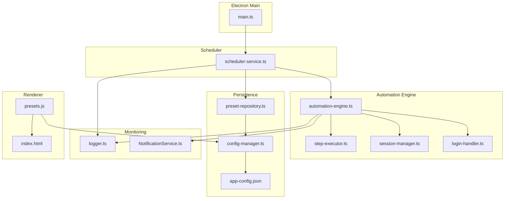
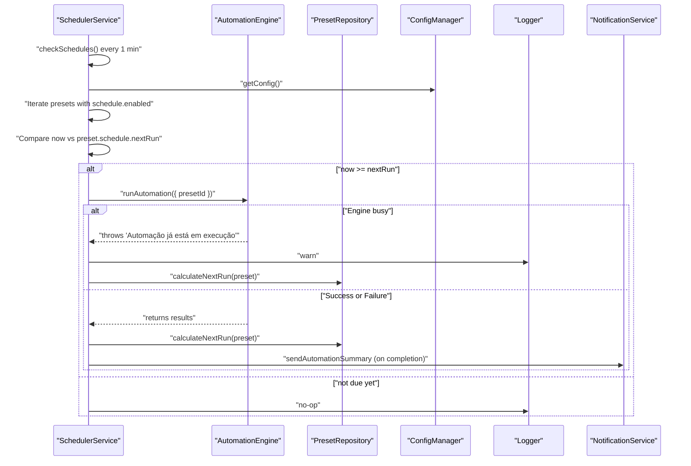
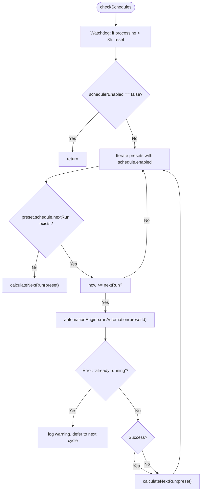
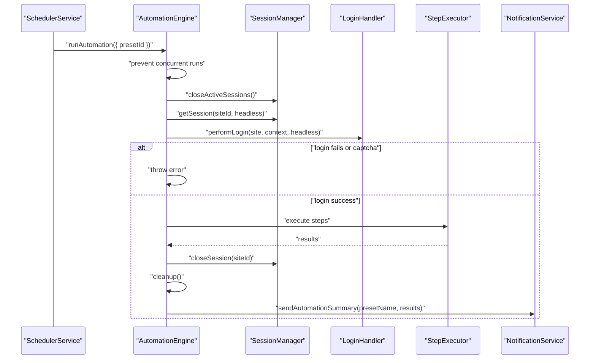
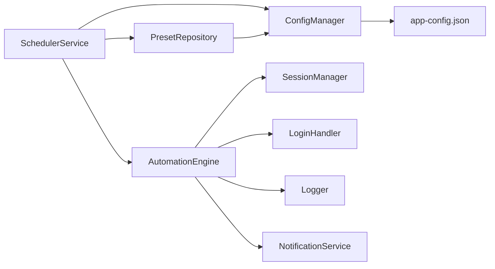

# Scheduling System

<cite>
**Referenced Files in This Document**
- [scheduler-service.ts](file://app/automation/engine/scheduler-service.ts)
- [automation-engine.ts](file://app/automation/engine/automation-engine.ts)
- [preset-repository.ts](file://app/automation/engine/preset-repository.ts)
- [config-manager.ts](file://app/config/config-manager.ts)
- [app-config.json](file://app/config/app-config.json)
- [logger.ts](file://app/config/logger.ts)
- [NotificationService.ts](file://app/core/notifications/NotificationService.ts)
- [main.ts](file://app/electron/main.ts)
- [session-manager.ts](file://app/automation/sessions/session-manager.ts)
- [login-handler.ts](file://app/automation/sessions/login-handler.ts)
- [step-executor.ts](file://app/automation/engine/step-executor.ts)
- [presets.js](file://app/renderer/modules/presets.js)
- [index.html](file://app/renderer/index.html)
</cite>

## Table of Contents
1. [Introduction](#introduction)
2. [Project Structure](#project-structure)
3. [Core Components](#core-components)
4. [Architecture Overview](#architecture-overview)
5. [Detailed Component Analysis](#detailed-component-analysis)
6. [Dependency Analysis](#dependency-analysis)
7. [Performance Considerations](#performance-considerations)
8. [Troubleshooting Guide](#troubleshooting-guide)
9. [Conclusion](#conclusion)
10. [Appendices](#appendices)

## Introduction
This document explains the Scheduling System that powers automated execution of browser-based workflows. It covers:
- Automated scheduling mechanisms (interval-based and fixed-time)
- Auto-recovery procedures and watchdogs
- Scheduler service architecture and preset repository integration
- Execution monitoring and logging
- Practical examples for configuring schedules, managing recurring tasks, handling failures, and implementing custom scheduling logic
- Performance considerations, resource management, and troubleshooting

## Project Structure
The scheduling system spans several modules:
- Scheduler service orchestrates periodic checks and triggers automation runs
- Automation engine executes browser-based steps and manages sessions
- Preset repository persists and updates scheduling metadata
- Configuration manager validates and stores scheduling settings
- Renderer integrates UI controls for schedule configuration
- Logging and notifications provide monitoring and reporting

**Diagram sources**
- [main.ts](file://app/electron/main.ts#L371-L372)
- [scheduler-service.ts](file://app/automation/engine/scheduler-service.ts#L1-L145)
- [automation-engine.ts](file://app/automation/engine/automation-engine.ts#L1-L611)
- [step-executor.ts](file://app/automation/engine/step-executor.ts#L1-L549)
- [session-manager.ts](file://app/automation/sessions/session-manager.ts#L1-L225)
- [login-handler.ts](file://app/automation/sessions/login-handler.ts#L1-L364)
- [preset-repository.ts](file://app/automation/engine/preset-repository.ts#L1-L34)
- [config-manager.ts](file://app/config/config-manager.ts#L1-L408)
- [app-config.json](file://app/config/app-config.json#L1-L1521)
- [logger.ts](file://app/config/logger.ts#L1-L104)
- [NotificationService.ts](file://app/core/notifications/NotificationService.ts#L1-L115)
- [presets.js](file://app/renderer/modules/presets.js#L92-L413)
- [index.html](file://app/renderer/index.html#L299-L316)

**Section sources**
- [main.ts](file://app/electron/main.ts#L355-L387)
- [scheduler-service.ts](file://app/automation/engine/scheduler-service.ts#L1-L145)
- [automation-engine.ts](file://app/automation/engine/automation-engine.ts#L1-L611)

## Core Components
- SchedulerService: Periodic checker that evaluates preset schedules and triggers automation runs
- AutomationEngine: Executes browser automation for configured presets, manages sessions, and handles timeouts
- PresetRepository: Persists preset updates including nextRun timestamps for scheduling
- ConfigManager: Validates and stores scheduling configuration (global schedulerEnabled flag, preset schedule modes)
- SessionManager and LoginHandler: Manage persistent browser contexts and handle login/re-authentication
- Logger and NotificationService: Provide execution logs and optional email summaries
- Renderer modules: UI controls to configure schedules and display next runs

**Section sources**
- [scheduler-service.ts](file://app/automation/engine/scheduler-service.ts#L6-L145)
- [automation-engine.ts](file://app/automation/engine/automation-engine.ts#L50-L611)
- [preset-repository.ts](file://app/automation/engine/preset-repository.ts#L4-L34)
- [config-manager.ts](file://app/config/config-manager.ts#L35-L78)
- [session-manager.ts](file://app/automation/sessions/session-manager.ts#L67-L225)
- [login-handler.ts](file://app/automation/sessions/login-handler.ts#L13-L364)
- [logger.ts](file://app/config/logger.ts#L1-L104)
- [NotificationService.ts](file://app/core/notifications/NotificationService.ts#L13-L115)
- [presets.js](file://app/renderer/modules/presets.js#L92-L413)
- [index.html](file://app/renderer/index.html#L299-L316)

## Architecture Overview
The scheduler runs continuously, checking every minute whether any preset’s nextRun time has passed. If so, it invokes the automation engine for that preset. The engine performs login, executes steps, and cleans up resources. The scheduler updates the preset’s nextRun timestamp after each successful or failed execution attempt.

**Diagram sources**
- [scheduler-service.ts](file://app/automation/engine/scheduler-service.ts#L16-L96)
- [automation-engine.ts](file://app/automation/engine/automation-engine.ts#L62-L238)
- [preset-repository.ts](file://app/automation/engine/preset-repository.ts#L20-L26)
- [config-manager.ts](file://app/config/config-manager.ts#L192-L194)
- [NotificationService.ts](file://app/core/notifications/NotificationService.ts#L75-L111)

## Detailed Component Analysis

### SchedulerService
Responsibilities:
- Starts/stops periodic checks
- Watches for long-running executions and resets stuck states
- Respects global schedulerEnabled flag
- Evaluates preset schedules and triggers automation
- Updates nextRun timestamps after each run

Key behaviors:
- Runs every 60 seconds
- Prevents overlapping runs via internal state flags
- Supports two scheduling modes:
  - Interval mode: adds intervalHours to current time
  - Fixed mode: selects next occurrence from sorted fixedTimes list
- On failure, still recalculates nextRun to prevent infinite loops

**Diagram sources**
- [scheduler-service.ts](file://app/automation/engine/scheduler-service.ts#L38-L96)

**Section sources**
- [scheduler-service.ts](file://app/automation/engine/scheduler-service.ts#L6-L145)

### AutomationEngine
Responsibilities:
- Executes automation for a given preset
- Manages browser contexts and pages
- Handles login and reauthentication
- Emits progress events and site completion events
- Implements a 2-hour global timeout to prevent indefinite hangs
- Cleans up resources and sends email summaries on completion

Key behaviors:
- Prevents concurrent runs
- Uses SessionManager for persistent contexts
- Uses LoginHandler for login/reauth flows
- Emits progress updates to the UI
- Sends automation summary emails via NotificationService

**Diagram sources**
- [automation-engine.ts](file://app/automation/engine/automation-engine.ts#L62-L238)
- [session-manager.ts](file://app/automation/sessions/session-manager.ts#L103-L138)
- [login-handler.ts](file://app/automation/sessions/login-handler.ts#L28-L77)
- [step-executor.ts](file://app/automation/engine/step-executor.ts#L59-L110)
- [NotificationService.ts](file://app/core/notifications/NotificationService.ts#L75-L111)

**Section sources**
- [automation-engine.ts](file://app/automation/engine/automation-engine.ts#L50-L611)
- [session-manager.ts](file://app/automation/sessions/session-manager.ts#L67-L225)
- [login-handler.ts](file://app/automation/sessions/login-handler.ts#L13-L364)
- [step-executor.ts](file://app/automation/engine/step-executor.ts#L25-L549)

### PresetRepository and ConfigManager
- PresetRepository exposes CRUD operations for presets and updates lastUsedAt
- ConfigManager defines the Preset schema including schedule fields (enabled, mode, intervalHours, fixedTimes, nextRun)
- app-config.json stores presets with schedule configurations

Key fields:
- schedule.enabled: toggles scheduling for a preset
- schedule.mode: "interval" or "fixed"
- schedule.intervalHours: hours between runs (1–24)
- schedule.fixedTimes: array of "HH:mm" times
- schedule.nextRun: ISO timestamp of next scheduled run

**Section sources**
- [preset-repository.ts](file://app/automation/engine/preset-repository.ts#L4-L34)
- [config-manager.ts](file://app/config/config-manager.ts#L35-L53)
- [app-config.json](file://app/config/app-config.json#L733-L743)

### Monitoring and Notifications
- Logger provides structured logs with daily rotation and automation-specific streams
- NotificationService can send email summaries upon automation completion
- Renderer displays next scheduled runs and allows toggling global scheduler

**Section sources**
- [logger.ts](file://app/config/logger.ts#L1-L104)
- [NotificationService.ts](file://app/core/notifications/NotificationService.ts#L13-L115)
- [presets.js](file://app/renderer/modules/presets.js#L100-L121)

## Dependency Analysis
The scheduler depends on:
- AutomationEngine for execution
- PresetRepository for updating nextRun timestamps
- ConfigManager for reading schedulerEnabled and preset schedules
- Logger for diagnostics
- NotificationService for post-run summaries

**Diagram sources**
- [scheduler-service.ts](file://app/automation/engine/scheduler-service.ts#L1-L4)
- [automation-engine.ts](file://app/automation/engine/automation-engine.ts#L1-L11)
- [preset-repository.ts](file://app/automation/engine/preset-repository.ts#L1-L2)
- [config-manager.ts](file://app/config/config-manager.ts#L1-L5)
- [app-config.json](file://app/config/app-config.json#L1-L10)
- [logger.ts](file://app/config/logger.ts#L1-L4)
- [NotificationService.ts](file://app/core/notifications/NotificationService.ts#L1-L3)

**Section sources**
- [scheduler-service.ts](file://app/automation/engine/scheduler-service.ts#L1-L145)
- [automation-engine.ts](file://app/automation/engine/automation-engine.ts#L1-L611)
- [preset-repository.ts](file://app/automation/engine/preset-repository.ts#L1-L34)
- [config-manager.ts](file://app/config/config-manager.ts#L1-L408)

## Performance Considerations
- Scheduler cadence: runs every 60 seconds; minimal overhead
- Watchdogs:
  - Internal watchdog in SchedulerService resets stuck processing after 3 hours
  - Global timeout in AutomationEngine prevents indefinite execution (2 hours)
  - Memory watchdog in Electron main logs memory usage hourly
- Resource management:
  - SessionManager persists browser contexts to disk for reuse
  - Cleanup ensures sessions and browser resources are released
- Logging:
  - Daily-rotated files reduce disk pressure
  - Separate automation logs aid performance analysis

[No sources needed since this section provides general guidance]

## Troubleshooting Guide
Common issues and resolutions:
- Scheduler not triggering:
  - Verify schedulerEnabled is true in configuration
  - Confirm preset.schedule.enabled is true and nextRun is set
  - Check logs for warnings about missing fixedTimes or engine busy states
- Engine busy errors:
  - Another automation is running; wait for completion or stop the current run
  - Review AutomationEngine.isAutomationRunning() and getAutomationStatus()
- Long-running tasks:
  - Watchdog resets stuck scheduler state after 3 hours
  - Global timeout in engine forces cleanup after 2 hours
- Session expiration during automation:
  - LoginHandler detects expired sessions and attempts reauthentication
  - If context is closed, restart automation
- Captcha detection:
  - LoginHandler requires manual intervention in visible mode
  - Ensure headless=false when resolving captchas
- Email notifications:
  - Enable notifications and configure SMTP in app-config.json
  - Check NotificationService logs for delivery errors

**Section sources**
- [scheduler-service.ts](file://app/automation/engine/scheduler-service.ts#L38-L96)
- [automation-engine.ts](file://app/automation/engine/automation-engine.ts#L62-L238)
- [session-manager.ts](file://app/automation/sessions/session-manager.ts#L103-L138)
- [login-handler.ts](file://app/automation/sessions/login-handler.ts#L28-L77)
- [NotificationService.ts](file://app/core/notifications/NotificationService.ts#L28-L70)

## Conclusion
The Scheduling System provides robust, fault-tolerant automation with:
- Flexible scheduling modes (interval and fixed-time)
- Built-in recovery via watchdogs and timeouts
- Persistent scheduling metadata via preset repository
- Comprehensive monitoring and notifications
- Clean resource management and session persistence

[No sources needed since this section summarizes without analyzing specific files]

## Appendices

### Practical Examples

- Configure interval-based scheduling:
  - Set preset.schedule.enabled = true
  - Set preset.schedule.mode = "interval"
  - Set preset.schedule.intervalHours to desired hours (1–24)
  - Save configuration; scheduler will compute nextRun automatically

- Configure fixed-time scheduling:
  - Set preset.schedule.enabled = true
  - Set preset.schedule.mode = "fixed"
  - Add one or more "HH:mm" entries to preset.schedule.fixedTimes
  - Save configuration; scheduler will compute nextRun based on the next occurrence

- Managing recurring tasks:
  - Use interval mode for periodic runs (e.g., every 3 hours)
  - Use fixed mode for specific times (e.g., 08:00, 14:00, 20:00)
  - Monitor nextRun timestamps in presets and adjust as needed

- Handling execution failures:
  - Scheduler recalculates nextRun even on failure to avoid infinite loops
  - Review automation logs for step-level errors
  - Use NotificationService email summaries to track outcomes

- Implementing custom scheduling logic:
  - Extend calculateNextRun to support additional modes (e.g., cron-like)
  - Add new fields to Preset schema in ConfigManager
  - Update UI controls in presets.js and index.html to expose new options

**Section sources**
- [config-manager.ts](file://app/config/config-manager.ts#L35-L53)
- [app-config.json](file://app/config/app-config.json#L733-L743)
- [scheduler-service.ts](file://app/automation/engine/scheduler-service.ts#L101-L142)
- [presets.js](file://app/renderer/modules/presets.js#L357-L413)
- [index.html](file://app/renderer/index.html#L299-L316)