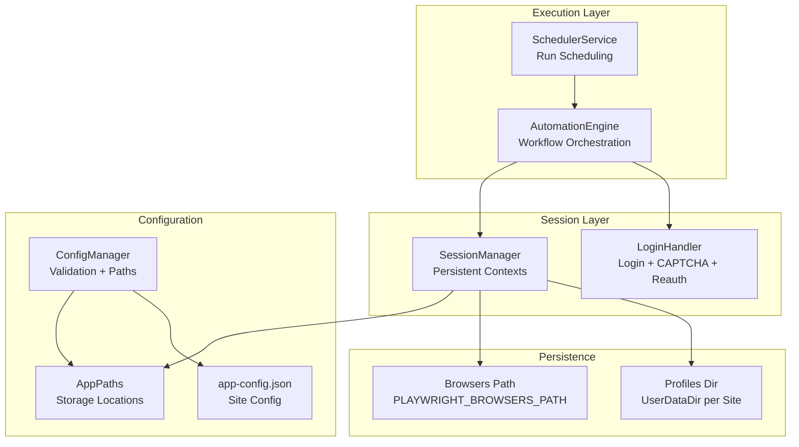
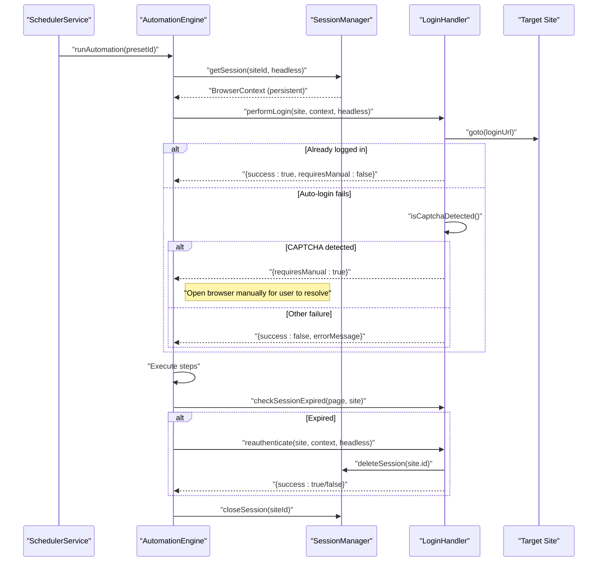
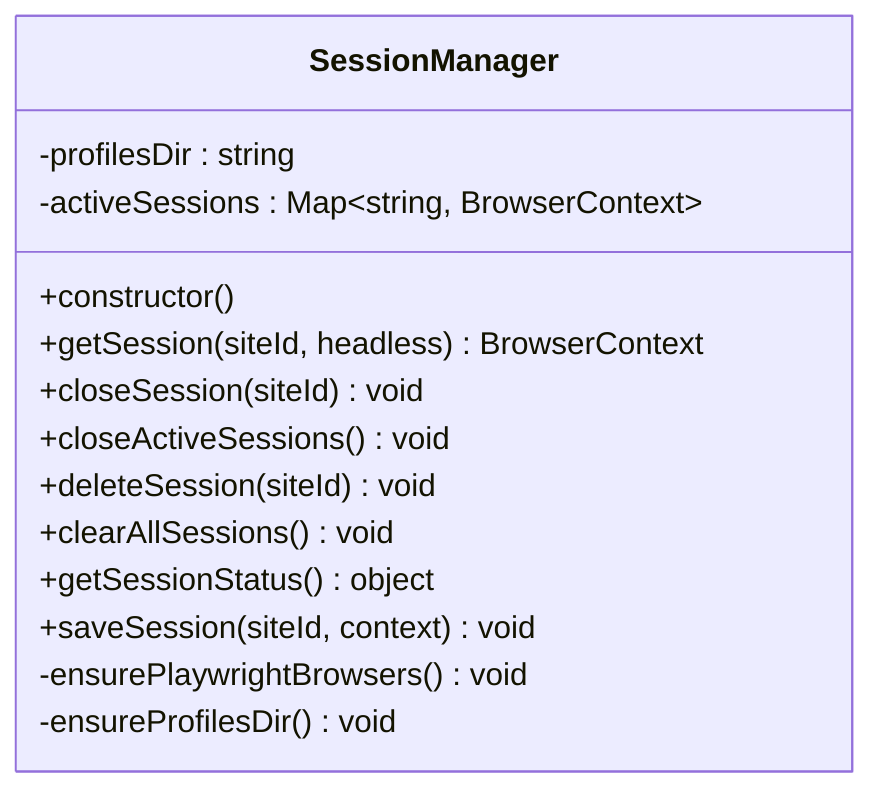
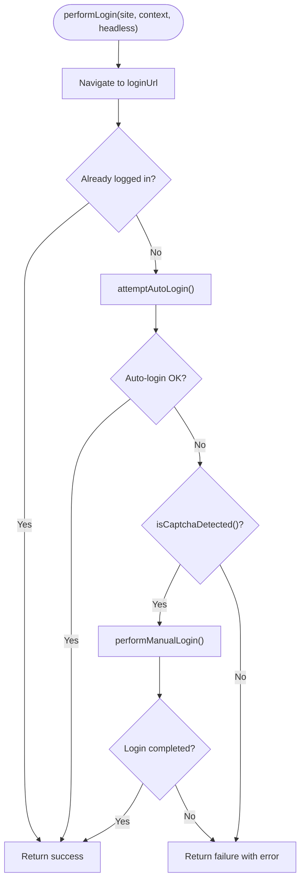
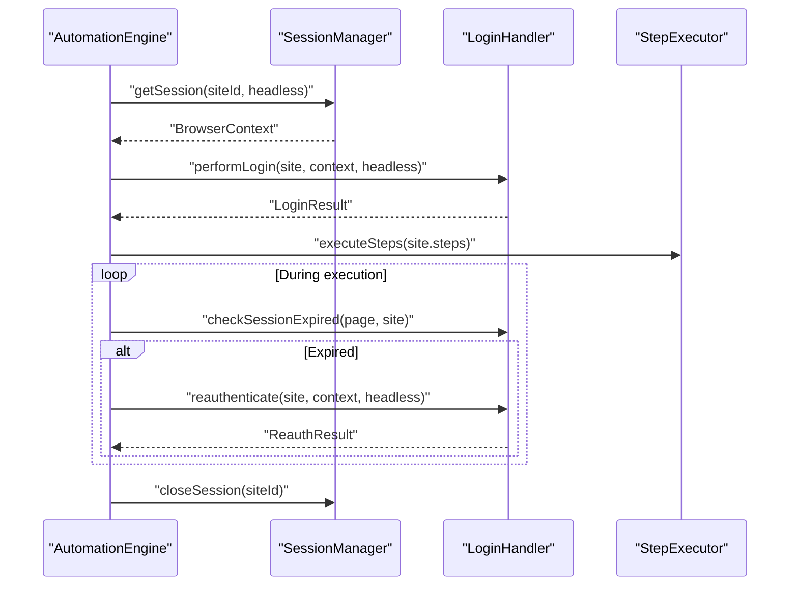
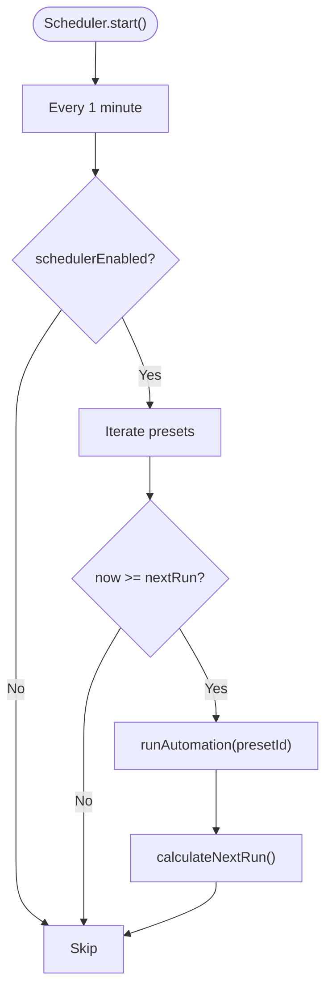
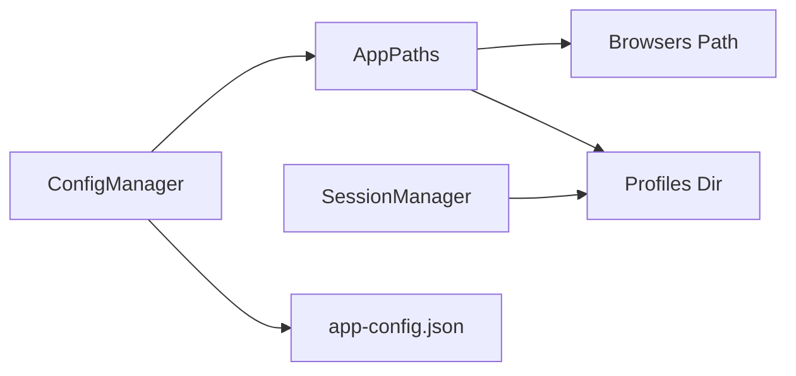
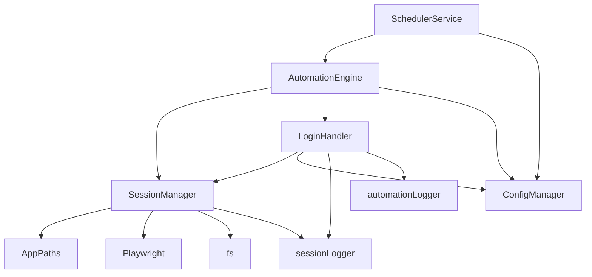

# Session Management

<cite>
**Referenced Files in This Document**
- [session-manager.ts](file://app/automation/sessions/session-manager.ts)
- [login-handler.ts](file://app/automation/sessions/login-handler.ts)
- [automation-engine.ts](file://app/automation/engine/automation-engine.ts)
- [scheduler-service.ts](file://app/automation/engine/scheduler-service.ts)
- [config-manager.ts](file://app/config/config-manager.ts)
- [app-config.json](file://app/config/app-config.json)
- [AppPaths.ts](file://app/core/utils/AppPaths.ts)
- [logger.ts](file://app/config/logger.ts)
</cite>

## Table of Contents
1. [Introduction](#introduction)
2. [Project Structure](#project-structure)
3. [Core Components](#core-components)
4. [Architecture Overview](#architecture-overview)
5. [Detailed Component Analysis](#detailed-component-analysis)
6. [Dependency Analysis](#dependency-analysis)
7. [Performance Considerations](#performance-considerations)
8. [Troubleshooting Guide](#troubleshooting-guide)
9. [Conclusion](#conclusion)

## Introduction
This document explains the Session Management system used by the Automatizador Bravo project. It covers persistent browser context implementation, session persistence strategies, anti-captcha support mechanisms, and session lifecycle management. It documents the session manager architecture, login handler functionality, re-authentication processes, and session recovery procedures. Practical examples show how to configure sessions, manage multiple browser contexts, and handle authentication failures. It also addresses session cleanup, memory management, and performance considerations for long-running automation tasks.

## Project Structure
The session management system is composed of:
- Session Manager: responsible for launching persistent browser contexts and managing their lifecycle
- Login Handler: orchestrates login attempts, detects CAPTCHA, and handles re-authentication
- Automation Engine: coordinates session usage during automated workflows
- Scheduler Service: triggers automation runs and manages session cleanup between runs
- Configuration Manager and App Paths: define where sessions and browsers are stored
- Logging: dedicated session logger for visibility into session lifecycle events

**Diagram sources**
- [session-manager.ts](file://app/automation/sessions/session-manager.ts#L67-L225)
- [login-handler.ts](file://app/automation/sessions/login-handler.ts#L13-L364)
- [automation-engine.ts](file://app/automation/engine/automation-engine.ts#L50-L611)
- [scheduler-service.ts](file://app/automation/engine/scheduler-service.ts#L6-L145)
- [config-manager.ts](file://app/config/config-manager.ts#L85-L408)
- [AppPaths.ts](file://app/core/utils/AppPaths.ts#L5-L60)
- [app-config.json](file://app/config/app-config.json#L1-L1521)

**Section sources**
- [session-manager.ts](file://app/automation/sessions/session-manager.ts#L1-L225)
- [login-handler.ts](file://app/automation/sessions/login-handler.ts#L1-L364)
- [automation-engine.ts](file://app/automation/engine/automation-engine.ts#L1-L611)
- [scheduler-service.ts](file://app/automation/engine/scheduler-service.ts#L1-L145)
- [config-manager.ts](file://app/config/config-manager.ts#L1-L408)
- [AppPaths.ts](file://app/core/utils/AppPaths.ts#L1-L60)
- [app-config.json](file://app/config/app-config.json#L1-L1521)

## Core Components
- SessionManager: Launches persistent Chromium contexts per site, manages active sessions in memory, and provides lifecycle operations (open/close/delete/clear). It ensures Playwright browsers are installed and migrated from legacy locations, and persists user data under a user-specific directory.
- LoginHandler: Performs login attempts, detects already logged-in states, checks for CAPTCHA challenges, and supports manual intervention. It can reauthenticate when sessions expire during automation.
- AutomationEngine: Integrates session management into the automation pipeline. It requests sessions per site, performs login when needed, executes steps, and monitors for session expiration to trigger reauthentication.
- SchedulerService: Coordinates scheduled runs and ensures session cleanup between runs to prevent resource leaks.
- ConfigManager and AppPaths: Provide validated configuration and define storage locations for browsers and profiles.
- Dedicated logging: sessionLogger provides focused logs for session lifecycle events.

**Section sources**
- [session-manager.ts](file://app/automation/sessions/session-manager.ts#L67-L225)
- [login-handler.ts](file://app/automation/sessions/login-handler.ts#L13-L364)
- [automation-engine.ts](file://app/automation/engine/automation-engine.ts#L262-L446)
- [scheduler-service.ts](file://app/automation/engine/scheduler-service.ts#L6-L145)
- [config-manager.ts](file://app/config/config-manager.ts#L85-L408)
- [AppPaths.ts](file://app/core/utils/AppPaths.ts#L5-L60)
- [logger.ts](file://app/config/logger.ts#L84-L104)

## Architecture Overview
The session management architecture centers around persistent browser contexts keyed by site identifiers. The system:
- Ensures Playwright browsers are available and migrates legacy installations
- Stores browser binaries and user profiles under user-specific directories
- Launches persistent contexts per site to reuse cookies, localStorage, and IndexedDB
- Provides APIs to close, delete, and clear sessions
- Integrates with the login handler to detect and recover from CAPTCHA and session expiration
- Uses the scheduler to coordinate long-running, recurring automation tasks

**Diagram sources**
- [scheduler-service.ts](file://app/automation/engine/scheduler-service.ts#L38-L96)
- [automation-engine.ts](file://app/automation/engine/automation-engine.ts#L290-L375)
- [session-manager.ts](file://app/automation/sessions/session-manager.ts#L103-L138)
- [login-handler.ts](file://app/automation/sessions/login-handler.ts#L28-L77)
- [login-handler.ts](file://app/automation/sessions/login-handler.ts#L333-L360)

## Detailed Component Analysis

### SessionManager
Responsibilities:
- Ensure Playwright browsers are installed and migrated from legacy locations
- Launch persistent Chromium contexts per site using userDataDir
- Manage active sessions in-memory and expose lifecycle operations
- Provide status reporting and migration of legacy profile directories

Key behaviors:
- Persistent context launch: Uses userDataDir per site to persist cookies, cache, and IndexedDB
- Headless defaults configurable via app config; adds anti-detection arguments
- Active session caching to avoid repeated launches
- Lifecycle operations:
  - getSession(siteId, headless): returns cached or creates new persistent context
  - closeSession(siteId): closes and removes from memory
  - closeActiveSessions(): closes all active contexts
  - deleteSession(siteId): closes and deletes physical profile directory
  - clearAllSessions(): clears all profiles and re-ensures directory
  - getSessionStatus(): reports active and persisted counts

Anti-captcha and detection:
- Launch arguments include anti-detection flags to reduce automation signals
- Headless mode is default; manual mode can be requested for CAPTCHA resolution

**Diagram sources**
- [session-manager.ts](file://app/automation/sessions/session-manager.ts#L67-L225)

**Section sources**
- [session-manager.ts](file://app/automation/sessions/session-manager.ts#L13-L65)
- [session-manager.ts](file://app/automation/sessions/session-manager.ts#L103-L138)
- [session-manager.ts](file://app/automation/sessions/session-manager.ts#L143-L200)
- [session-manager.ts](file://app/automation/sessions/session-manager.ts#L205-L222)

### LoginHandler
Responsibilities:
- Perform login automation with robust detection of already logged-in states
- Detect CAPTCHA presence and escalate to manual intervention
- Validate login success and detect session expiration during automation
- Reauthenticate by deleting the expired session and performing a fresh login

Core logic:
- performLogin: navigates to login URL, checks already logged-in, attempts auto-login, detects CAPTCHA, falls back to manual login
- attemptAutoLogin: fills credentials, clicks login button, waits for navigation, validates success
- isCaptchaDetected: scans DOM and page content for CAPTCHA indicators
- performManualLogin: waits up to a fixed timeout for user to complete login
- checkSessionExpired: detects login page redirects and explicit “session expired” indicators
- reauthenticate: deletes the expired session and performs a new login

**Diagram sources**
- [login-handler.ts](file://app/automation/sessions/login-handler.ts#L28-L77)
- [login-handler.ts](file://app/automation/sessions/login-handler.ts#L108-L151)
- [login-handler.ts](file://app/automation/sessions/login-handler.ts#L187-L209)
- [login-handler.ts](file://app/automation/sessions/login-handler.ts#L214-L246)

**Section sources**
- [login-handler.ts](file://app/automation/sessions/login-handler.ts#L13-L364)

### AutomationEngine Integration
How sessions are used:
- Retrieves or creates a persistent context per site before starting automation
- Opens pages and navigates to URLs as needed
- Performs login when required, then executes configured steps
- Monitors for session expiration during execution and triggers reauthentication
- Cleans up by closing the session after each site completes

**Diagram sources**
- [automation-engine.ts](file://app/automation/engine/automation-engine.ts#L290-L375)
- [session-manager.ts](file://app/automation/sessions/session-manager.ts#L103-L138)
- [login-handler.ts](file://app/automation/sessions/login-handler.ts#L333-L360)

**Section sources**
- [automation-engine.ts](file://app/automation/engine/automation-engine.ts#L262-L446)

### SchedulerService Coordination
- Starts periodic checks to trigger automation runs
- Pauses when scheduler is disabled globally
- Calculates next run based on interval or fixed times modes
- Handles busy-state gracefully and continues scheduling

**Diagram sources**
- [scheduler-service.ts](file://app/automation/engine/scheduler-service.ts#L16-L96)
- [scheduler-service.ts](file://app/automation/engine/scheduler-service.ts#L101-L142)

**Section sources**
- [scheduler-service.ts](file://app/automation/engine/scheduler-service.ts#L6-L145)

### Configuration and Storage Paths
- AppPaths defines base data path, config path, logs path, profiles path, browsers path, and snapshots path
- SessionManager and ConfigManager ensure directories exist and migrate legacy locations
- PLAYWRIGHT_BROWSERS_PATH is set to the user-specific browsers directory

**Diagram sources**
- [AppPaths.ts](file://app/core/utils/AppPaths.ts#L11-L39)
- [session-manager.ts](file://app/automation/sessions/session-manager.ts#L13-L25)
- [config-manager.ts](file://app/config/config-manager.ts#L133-L190)
- [app-config.json](file://app/config/app-config.json#L1-L1521)

**Section sources**
- [AppPaths.ts](file://app/core/utils/AppPaths.ts#L5-L60)
- [session-manager.ts](file://app/automation/sessions/session-manager.ts#L13-L25)
- [config-manager.ts](file://app/config/config-manager.ts#L133-L190)

## Dependency Analysis
- SessionManager depends on:
  - AppPaths for storage locations
  - Playwright for persistent context creation
  - fs for directory management and migrations
  - sessionLogger for lifecycle logs
- LoginHandler depends on:
  - SessionManager to delete sessions during reauth
  - ConfigManager for action delays and timeouts
  - sessionLogger and automationLogger for diagnostics
- AutomationEngine depends on:
  - SessionManager for contexts
  - LoginHandler for login and reauth
  - ConfigManager for headless mode and delays
- SchedulerService depends on:
  - AutomationEngine to run scheduled tasks
  - ConfigManager for scheduler enablement and preset schedules

**Diagram sources**
- [session-manager.ts](file://app/automation/sessions/session-manager.ts#L1-L11)
- [login-handler.ts](file://app/automation/sessions/login-handler.ts#L1-L5)
- [automation-engine.ts](file://app/automation/engine/automation-engine.ts#L1-L12)
- [scheduler-service.ts](file://app/automation/engine/scheduler-service.ts#L1-L5)

**Section sources**
- [session-manager.ts](file://app/automation/sessions/session-manager.ts#L1-L11)
- [login-handler.ts](file://app/automation/sessions/login-handler.ts#L1-L5)
- [automation-engine.ts](file://app/automation/engine/automation-engine.ts#L1-L12)
- [scheduler-service.ts](file://app/automation/engine/scheduler-service.ts#L1-L5)

## Performance Considerations
- Persistent contexts reduce overhead by reusing cookies and caches
- Anti-detection arguments minimize detection and retries
- Headless mode reduces resource usage; manual mode is reserved for CAPTCHA
- Long-running tasks should:
  - Periodically check and close sessions to free memory
  - Use scheduler to stagger runs and avoid overlapping heavy loads
  - Monitor logs for session expiration and reauthenticate proactively
- Disk I/O:
  - Profiles are stored under user-specific directories; ensure adequate disk space
  - Consider rotating logs to avoid excessive disk usage

[No sources needed since this section provides general guidance]

## Troubleshooting Guide
Common issues and resolutions:
- Playwright browsers not installed:
  - SessionManager attempts installation and migration; check logs for errors and verify PLAYWRIGHT_BROWSERS_PATH
- CAPTCHA detected:
  - LoginHandler escalates to manual mode; run in visible mode once to resolve
- Session expired during automation:
  - AutomationEngine detects expiration and triggers reauthentication; ensure context remains open
- Profile corruption:
  - Delete the specific site’s profile via deleteSession and re-run login
- Scheduler conflicts:
  - If “Automation already running” occurs, wait for completion or stop the scheduler temporarily

Operational tips:
- Use sessionLogger to track session lifecycle events
- Verify AppPaths and ensure directories exist
- Confirm headless mode aligns with environment constraints

**Section sources**
- [session-manager.ts](file://app/automation/sessions/session-manager.ts#L13-L65)
- [login-handler.ts](file://app/automation/sessions/login-handler.ts#L56-L67)
- [automation-engine.ts](file://app/automation/engine/automation-engine.ts#L350-L375)
- [logger.ts](file://app/config/logger.ts#L84-L104)

## Conclusion
The Session Management system provides a robust, persistent, and scalable foundation for browser automation. It leverages Playwright’s persistent contexts to reuse authentication state, integrates anti-captcha detection and manual fallback, and supports re-authentication when sessions expire. The system is designed for long-running automation with careful session lifecycle management, logging, and scheduling coordination. By following the configuration and operational guidelines in this document, teams can reliably automate multiple sites while maintaining performance and resilience.