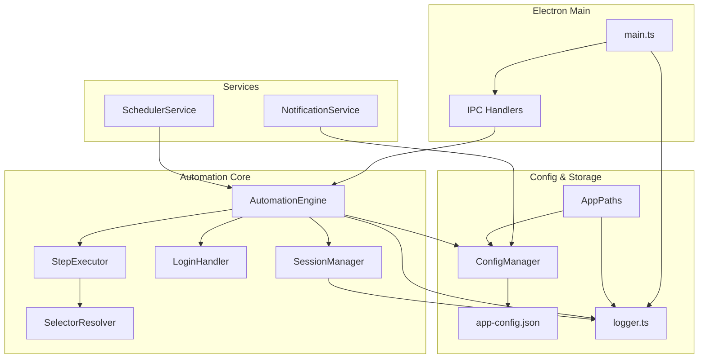
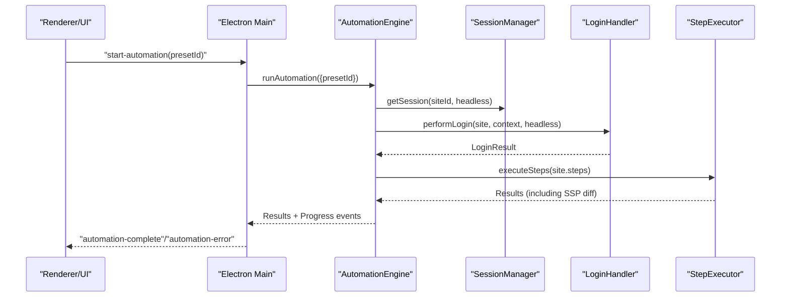
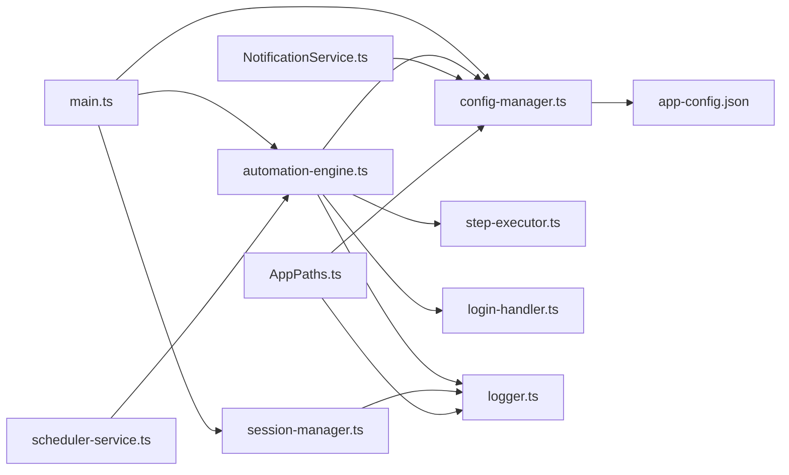

# Troubleshooting

<cite>
**Referenced Files in This Document**
- [main.ts](file://app/electron/main.ts)
- [logger.ts](file://app/config/logger.ts)
- [app-config.json](file://app/config/app-config.json)
- [automation-engine.ts](file://app/automation/engine/automation-engine.ts)
- [session-manager.ts](file://app/automation/sessions/session-manager.ts)
- [login-handler.ts](file://app/automation/sessions/login-handler.ts)
- [step-executor.ts](file://app/automation/engine/step-executor.ts)
- [config-manager.ts](file://app/config/config-manager.ts)
- [scheduler-service.ts](file://app/automation/engine/scheduler-service.ts)
- [NotificationService.ts](file://app/core/notifications/NotificationService.ts)
- [AppPaths.ts](file://app/core/utils/AppPaths.ts)
- [package.json](file://package.json)
- [README](file://README)
</cite>

## Table of Contents
1. [Introduction](#introduction)
2. [Project Structure](#project-structure)
3. [Core Components](#core-components)
4. [Architecture Overview](#architecture-overview)
5. [Detailed Component Analysis](#detailed-component-analysis)
6. [Dependency Analysis](#dependency-analysis)
7. [Performance Considerations](#performance-considerations)
8. [Troubleshooting Guide](#troubleshooting-guide)
9. [Conclusion](#conclusion)
10. [Appendices](#appendices)

## Introduction
This document provides comprehensive troubleshooting guidance for Automatizador Bravo. It covers common issues, error codes and meanings, performance tuning, session recovery, debugging strategies, log analysis, diagnostic tools, build/runtime errors, automation failures, and configuration problems. It includes step-by-step resolution guides, preventive measures, and escalation procedures for complex issues.

## Project Structure
Automatizador Bravo is an Electron-based desktop application that orchestrates web automation using Playwright. The system is organized around:
- Electron main process and IPC handlers
- Automation engine and step executor
- Session management and login handler
- Configuration manager and presets
- Logging infrastructure
- Scheduler service
- Notifications service

**Diagram sources**
- [main.ts](file://app/electron/main.ts#L117-L281)
- [automation-engine.ts](file://app/automation/engine/automation-engine.ts#L50-L238)
- [step-executor.ts](file://app/automation/engine/step-executor.ts#L25-L110)
- [login-handler.ts](file://app/automation/sessions/login-handler.ts#L13-L77)
- [session-manager.ts](file://app/automation/sessions/session-manager.ts#L67-L138)
- [config-manager.ts](file://app/config/config-manager.ts#L85-L190)
- [scheduler-service.ts](file://app/automation/engine/scheduler-service.ts#L6-L96)
- [NotificationService.ts](file://app/core/notifications/NotificationService.ts#L13-L70)
- [logger.ts](file://app/config/logger.ts#L15-L104)
- [AppPaths.ts](file://app/core/utils/AppPaths.ts#L5-L58)

**Section sources**
- [main.ts](file://app/electron/main.ts#L1-L387)
- [logger.ts](file://app/config/logger.ts#L1-L104)
- [app-config.json](file://app/config/app-config.json#L1-L1521)
- [automation-engine.ts](file://app/automation/engine/automation-engine.ts#L1-L611)
- [session-manager.ts](file://app/automation/sessions/session-manager.ts#L1-L225)
- [login-handler.ts](file://app/automation/sessions/login-handler.ts#L1-L364)
- [step-executor.ts](file://app/automation/engine/step-executor.ts#L1-L549)
- [config-manager.ts](file://app/config/config-manager.ts#L1-L408)
- [scheduler-service.ts](file://app/automation/engine/scheduler-service.ts#L1-L145)
- [NotificationService.ts](file://app/core/notifications/NotificationService.ts#L1-L115)
- [AppPaths.ts](file://app/core/utils/AppPaths.ts#L1-L60)

## Core Components
- Electron main process and IPC: Initializes app, tray, window, registers IPC handlers, and starts scheduler.
- AutomationEngine: Orchestrates site runs, manages timeouts, emits progress, handles errors, and triggers notifications.
- StepExecutor: Executes configured steps with retries, delays, and Safe Snapshot Policy (SSP) for downloads.
- SessionManager: Manages persistent browser contexts per site, auto-installs Playwright browsers, and cleans up sessions.
- LoginHandler: Performs auto-login, detects CAPTCHA, supports manual intervention, and re-authentication.
- ConfigManager: Validates and persists configuration, migrates legacy structures, resolves paths, and exports/import presets.
- SchedulerService: Periodically checks preset schedules and triggers automation runs.
- NotificationService: Sends automation summaries via SMTP.
- Logging: Winston-based logging split into console, daily rotation, and specialized streams for automation and sessions.

**Section sources**
- [main.ts](file://app/electron/main.ts#L117-L281)
- [automation-engine.ts](file://app/automation/engine/automation-engine.ts#L50-L238)
- [step-executor.ts](file://app/automation/engine/step-executor.ts#L25-L110)
- [session-manager.ts](file://app/automation/sessions/session-manager.ts#L67-L138)
- [login-handler.ts](file://app/automation/sessions/login-handler.ts#L13-L77)
- [config-manager.ts](file://app/config/config-manager.ts#L85-L190)
- [scheduler-service.ts](file://app/automation/engine/scheduler-service.ts#L6-L96)
- [NotificationService.ts](file://app/core/notifications/NotificationService.ts#L13-L70)
- [logger.ts](file://app/config/logger.ts#L15-L104)

## Architecture Overview
The system follows a layered architecture:
- UI and IPC: Electron main process exposes handlers for configuration, presets, sessions, and automation control.
- Automation pipeline: AutomationEngine coordinates sessions, login, step execution, and post-processing.
- Persistence: SessionManager stores browser contexts and profile data; ConfigManager persists configuration and presets.
- Observability: Logging and notifications provide diagnostics and status updates.

**Diagram sources**
- [main.ts](file://app/electron/main.ts#L214-L232)
- [automation-engine.ts](file://app/automation/engine/automation-engine.ts#L62-L238)
- [session-manager.ts](file://app/automation/sessions/session-manager.ts#L103-L138)
- [login-handler.ts](file://app/automation/sessions/login-handler.ts#L28-L77)
- [step-executor.ts](file://app/automation/engine/step-executor.ts#L59-L110)

## Detailed Component Analysis

### AutomationEngine
Key behaviors:
- Enforces a global 2-hour timeout and stops gracefully.
- Supports preset isolation and per-site credential injection.
- Emits progress events and site-complete events to the UI.
- Handles session expiration during execution and re-authenticates.
- Consolidates results and sends automation summary notifications.

Common issues:
- “Automação já está em execução” indicates concurrent runs.
- “Preset não encontrado” or “Nenhum site configurado” indicate missing presets or empty site lists.
- “Falha no login” or “CAPTCHA detectado em modo invisível” require manual intervention or visible mode.

**Section sources**
- [automation-engine.ts](file://app/automation/engine/automation-engine.ts#L62-L238)
- [automation-engine.ts](file://app/automation/engine/automation-engine.ts#L280-L446)
- [automation-engine.ts](file://app/automation/engine/automation-engine.ts#L561-L608)

### StepExecutor
Key behaviors:
- Executes steps with configurable timeout/retry and action delay.
- Supports fillDateRange with dynamic token resolution and SSP-aware download handling.
- Creates target directories automatically for downloads.
- Captures screenshots on errors.

Common issues:
- “Seletor obrigatório” or “Valor obrigatório” indicate misconfigured steps.
- “Falha no step X” indicates selector or value mismatch.
- “Formato de data inválido” suggests incorrect date range tokens.

**Section sources**
- [step-executor.ts](file://app/automation/engine/step-executor.ts#L59-L110)
- [step-executor.ts](file://app/automation/engine/step-executor.ts#L137-L147)
- [step-executor.ts](file://app/automation/engine/step-executor.ts#L212-L260)
- [step-executor.ts](file://app/automation/engine/step-executor.ts#L397-L511)

### SessionManager and LoginHandler
Key behaviors:
- Ensures Playwright Chromium is installed and functional.
- Launches persistent contexts per site with anti-detection arguments.
- Detects session expiration and triggers reauthentication.
- Provides manual login fallback when CAPTCHA is detected.

Common issues:
- “Contexto do navegador inválido ou fechado” indicates context corruption.
- “CAPTCHA detectado em modo invisível” requires visible mode for manual resolution.
- “Sessão expirada detectada” triggers reauthentication flow.

**Section sources**
- [session-manager.ts](file://app/automation/sessions/session-manager.ts#L13-L65)
- [session-manager.ts](file://app/automation/sessions/session-manager.ts#L103-L138)
- [login-handler.ts](file://app/automation/sessions/login-handler.ts#L28-L77)
- [login-handler.ts](file://app/automation/sessions/login-handler.ts#L288-L360)

### ConfigManager and app-config.json
Key behaviors:
- Validates configuration using Zod schemas.
- Migrates legacy structures (global sites to presets).
- Resolves environment variables and user path remapping.
- Supports export/import of presets.

Common issues:
- Validation errors on invalid JSON or missing fields.
- Legacy structure migration warnings.
- Path resolution errors due to user profile changes.

**Section sources**
- [config-manager.ts](file://app/config/config-manager.ts#L85-L190)
- [config-manager.ts](file://app/config/config-manager.ts#L133-L190)
- [config-manager.ts](file://app/config/config-manager.ts#L98-L124)
- [app-config.json](file://app/config/app-config.json#L1-L1521)

### SchedulerService
Key behaviors:
- Checks schedules every minute and triggers automation runs.
- Implements watchdog to prevent long-running stuck states.
- Supports interval and fixed-time modes.

Common issues:
- “Engine ocupado” defers execution until next cycle.
- Missing fixed times disable scheduling.
- Long-running tasks trigger forced reset.

**Section sources**
- [scheduler-service.ts](file://app/automation/engine/scheduler-service.ts#L38-L96)
- [scheduler-service.ts](file://app/automation/engine/scheduler-service.ts#L101-L142)

### NotificationService
Key behaviors:
- Sends automation summary emails via SMTP.
- Requires complete SMTP configuration.

Common issues:
- “Notificação desabilitada” or “Configuração SMTP incompleta.”
- SMTP errors during send.

**Section sources**
- [NotificationService.ts](file://app/core/notifications/NotificationService.ts#L28-L70)
- [NotificationService.ts](file://app/core/notifications/NotificationService.ts#L75-L111)

### Logging and Diagnostics
- Winston transports for console, daily rotated files, and specialized streams.
- Automation and session-specific loggers.
- Log locations managed by AppPaths.

Common issues:
- Missing log directories cause lazy creation.
- High memory usage triggers watchdog warnings.

**Section sources**
- [logger.ts](file://app/config/logger.ts#L15-L104)
- [AppPaths.ts](file://app/core/utils/AppPaths.ts#L44-L58)
- [main.ts](file://app/electron/main.ts#L101-L114)

## Dependency Analysis

**Diagram sources**
- [main.ts](file://app/electron/main.ts#L1-L387)
- [automation-engine.ts](file://app/automation/engine/automation-engine.ts#L1-L611)
- [step-executor.ts](file://app/automation/engine/step-executor.ts#L1-L549)
- [session-manager.ts](file://app/automation/sessions/session-manager.ts#L1-L225)
- [login-handler.ts](file://app/automation/sessions/login-handler.ts#L1-L364)
- [config-manager.ts](file://app/config/config-manager.ts#L1-L408)
- [scheduler-service.ts](file://app/automation/engine/scheduler-service.ts#L1-L145)
- [NotificationService.ts](file://app/core/notifications/NotificationService.ts#L1-L115)
- [logger.ts](file://app/config/logger.ts#L1-L104)
- [AppPaths.ts](file://app/core/utils/AppPaths.ts#L1-L60)
- [app-config.json](file://app/config/app-config.json#L1-L1521)

**Section sources**
- [main.ts](file://app/electron/main.ts#L1-L387)
- [automation-engine.ts](file://app/automation/engine/automation-engine.ts#L1-L611)
- [step-executor.ts](file://app/automation/engine/step-executor.ts#L1-L549)
- [session-manager.ts](file://app/automation/sessions/session-manager.ts#L1-L225)
- [login-handler.ts](file://app/automation/sessions/login-handler.ts#L1-L364)
- [config-manager.ts](file://app/config/config-manager.ts#L1-L408)
- [scheduler-service.ts](file://app/automation/engine/scheduler-service.ts#L1-L145)
- [NotificationService.ts](file://app/core/notifications/NotificationService.ts#L1-L115)
- [logger.ts](file://app/config/logger.ts#L1-L104)
- [AppPaths.ts](file://app/core/utils/AppPaths.ts#L1-L60)
- [app-config.json](file://app/config/app-config.json#L1-L1521)

## Performance Considerations
- Headless mode reduces resource usage; enable via configuration.
- Action delay and retries balance reliability vs. speed.
- Daily log rotation prevents disk growth.
- Memory watchdog warns on elevated RSS (>800 MB).
- Auto-installation of Playwright browsers occurs on first run; ensure network access.

[No sources needed since this section provides general guidance]

## Troubleshooting Guide

### Build Issues
Symptoms:
- “File Locked” or “EPERM” during build.
- Missing or corrupted Playwright browsers.

Resolution steps:
- Close running instances and rerun the build command.
- Use the provided one-command build script to stop previous processes and clean releases.
- If browsers fail to install, ensure network connectivity and retry; the app attempts to auto-install Chromium into the AppData path.

Diagnostic tips:
- Check release directory permissions.
- Verify electron-builder configuration and extraResources.

**Section sources**
- [README](file://README#L25-L29)
- [package.json](file://package.json#L13-L17)
- [session-manager.ts](file://app/automation/sessions/session-manager.ts#L13-L65)

### Runtime Errors
Symptoms:
- “Automação já está em execução.”
- “Falha no login” or “CAPTCHA detectado em modo invisível.”

Resolution steps:
- Wait for current run to finish or stop it via IPC.
- Run once in visible mode to resolve CAPTCHA challenges.
- Verify credentials and selectors in presets.

Diagnostic tips:
- Inspect automation logs for step-by-step failures.
- Use “open-browser-for-login” to troubleshoot login pages.

**Section sources**
- [automation-engine.ts](file://app/automation/engine/automation-engine.ts#L62-L81)
- [login-handler.ts](file://app/automation/sessions/login-handler.ts#L56-L63)
- [main.ts](file://app/electron/main.ts#L198-L200)

### Automation Failures
Symptoms:
- “Nenhum site configurado neste Preset.”
- “Falha no step X: ...”
- “Formato de data inválido após resolução.”

Resolution steps:
- Add sites to the preset or select a preset with sites.
- Correct selector/value pairs and ensure elements are present.
- Use supported date tokens for fillDateRange.

Diagnostic tips:
- Review step-by-step progress and error messages.
- Enable visible mode to observe UI interactions.

**Section sources**
- [automation-engine.ts](file://app/automation/engine/automation-engine.ts#L92-L116)
- [step-executor.ts](file://app/automation/engine/step-executor.ts#L102-L109)
- [step-executor.ts](file://app/automation/engine/step-executor.ts#L233-L235)

### Session Recovery Procedures
Symptoms:
- “Sessão expirada detectada.”
- “Contexto do navegador foi fechado.”

Resolution steps:
- The system deletes the expired session and re-authenticates automatically.
- If context is closed, restart the automation run.

Diagnostic tips:
- Monitor session logs for expiration indicators.
- Ensure persistent contexts are not manually deleted.

**Section sources**
- [login-handler.ts](file://app/automation/sessions/login-handler.ts#L333-L360)
- [session-manager.ts](file://app/automation/sessions/session-manager.ts#L143-L150)

### Configuration Problems
Symptoms:
- Validation errors on startup.
- Paths not resolving after user profile changes.

Resolution steps:
- Validate JSON structure against schemas; fix missing fields.
- The system remaps legacy paths and environment variables automatically.

Diagnostic tips:
- Export/import configuration to compare differences.
- Check AppPaths for correct directories.

**Section sources**
- [config-manager.ts](file://app/config/config-manager.ts#L133-L190)
- [config-manager.ts](file://app/config/config-manager.ts#L98-L124)
- [AppPaths.ts](file://app/core/utils/AppPaths.ts#L44-L58)

### Logging and Debugging Strategies
- Increase log verbosity via environment variables for automation and session logs.
- Review daily rotated logs for timestamps and stack traces.
- Use DevTools in development builds to inspect UI and console.

Diagnostic tips:
- Look for “[CRÍTICO]” entries indicating forced shutdowns or watchdog alerts.
- Check automation-progress events for step-by-step visibility.

**Section sources**
- [logger.ts](file://app/config/logger.ts#L15-L104)
- [main.ts](file://app/electron/main.ts#L313-L334)
- [automation-engine.ts](file://app/automation/engine/automation-engine.ts#L548-L556)

### Performance Troubleshooting
- Reduce retries and action delay for faster runs.
- Switch to headless mode for production runs.
- Monitor memory usage; investigate long-running tasks.

Diagnostic tips:
- Watchdog logs warn on elevated RSS.
- Scheduler watchdog resets stuck states after 3 hours.

**Section sources**
- [main.ts](file://app/electron/main.ts#L101-L114)
- [scheduler-service.ts](file://app/automation/engine/scheduler-service.ts#L39-L44)

### Preventive Measures
- Keep Playwright browsers updated automatically.
- Validate presets regularly and keep date tokens current.
- Use visible mode for initial login and CAPTCHA resolution.
- Schedule runs with sufficient intervals to avoid overlap.

[No sources needed since this section provides general guidance]

### Escalation Procedures
- For persistent CAPTCHA or anti-bot challenges, escalate to manual verification steps.
- If scheduler remains stuck, force restart the service and review logs.
- For SMTP delivery issues, validate credentials and network access.

[No sources needed since this section provides general guidance]

## Conclusion
This guide consolidates actionable troubleshooting steps for Automatizador Bravo across build, runtime, automation, session, configuration, logging, and performance domains. By following the diagnostic flows and applying the recommended resolutions, most issues can be resolved quickly. For persistent or complex scenarios, escalate with detailed logs and configuration exports.

[No sources needed since this section summarizes without analyzing specific files]

## Appendices

### Quick Reference: Common Errors and Fixes
- “Automação já está em execução”: Wait or stop current run.
- “CAPTCHA detectado em modo invisível”: Run in visible mode once.
- “Falha no login”: Verify credentials and selectors.
- “Nenhum site configurado”: Add sites to preset.
- “Sessão expirada”: Re-authenticate automatically; restart if needed.
- “Falha ao enviar e-mail”: Check SMTP configuration.

**Section sources**
- [automation-engine.ts](file://app/automation/engine/automation-engine.ts#L62-L81)
- [login-handler.ts](file://app/automation/sessions/login-handler.ts#L56-L63)
- [login-handler.ts](file://app/automation/sessions/login-handler.ts#L333-L360)
- [NotificationService.ts](file://app/core/notifications/NotificationService.ts#L32-L41)