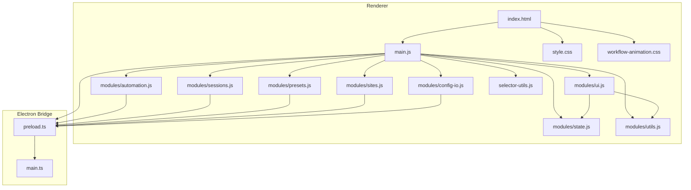
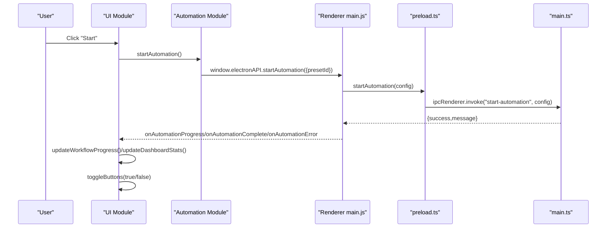
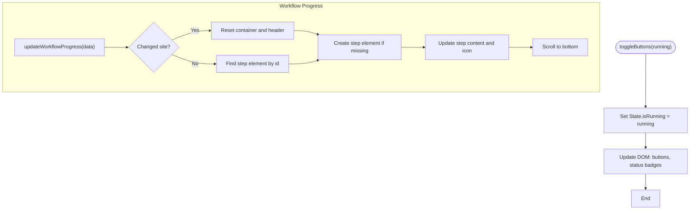
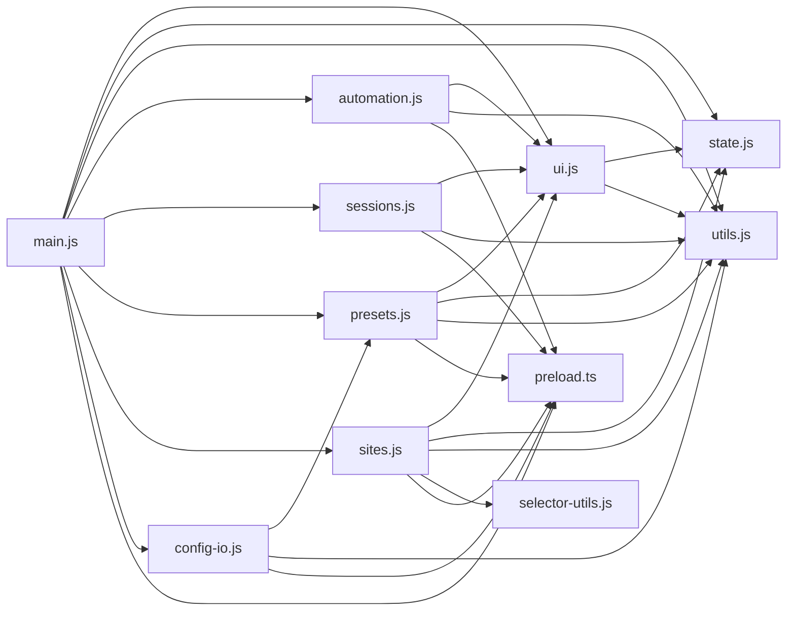

# User Interface

<cite>
**Referenced Files in This Document**
- [index.html](file://app/renderer/index.html)
- [main.js](file://app/renderer/main.js)
- [style.css](file://app/renderer/style.css)
- [workflow-animation.css](file://app/renderer/workflow-animation.css)
- [selector-utils.js](file://app/renderer/selector-utils.js)
- [preload.ts](file://app/electron/preload.ts)
- [main.ts](file://app/electron/main.ts)
- [ui.js](file://app/renderer/modules/ui.js)
- [state.js](file://app/renderer/modules/state.js)
- [utils.js](file://app/renderer/modules/utils.js)
- [automation.js](file://app/renderer/modules/automation.js)
- [sessions.js](file://app/renderer/modules/sessions.js)
- [presets.js](file://app/renderer/modules/presets.js)
- [sites.js](file://app/renderer/modules/sites.js)
- [config-io.js](file://app/renderer/modules/config-io.js)
</cite>

## Table of Contents
1. [Introduction](#introduction)
2. [Project Structure](#project-structure)
3. [Core Components](#core-components)
4. [Architecture Overview](#architecture-overview)
5. [Detailed Component Analysis](#detailed-component-analysis)
6. [Dependency Analysis](#dependency-analysis)
7. [Performance Considerations](#performance-considerations)
8. [Troubleshooting Guide](#troubleshooting-guide)
9. [Conclusion](#conclusion)
10. [Appendices](#appendices)

## Introduction
This document describes the User Interface system built with Electron’s renderer process. It explains the modular architecture, real-time progress tracking via IPC, session management interface, and the module-based approach for automation, sessions, presets, and configuration management. Practical examples illustrate UI interactions, real-time updates, responsive design, and accessibility considerations, along with component composition patterns, state management, and integration with the underlying automation engine.

## Project Structure
The UI is organized around a single-page application with a modular renderer architecture:
- Entry point initializes modules and exposes global handlers for HTML onclick attributes.
- Modules encapsulate UI logic, state, utilities, automation control, sessions, presets, sites, and configuration import/export.
- Styles define a responsive, accessible, and performance-conscious theme.
- IPC bridge connects the renderer to the main process for automation, configuration, and session operations.

**Diagram sources**
- [index.html](file://app/renderer/index.html#L1-L640)
- [main.js](file://app/renderer/main.js#L1-L182)
- [ui.js](file://app/renderer/modules/ui.js#L1-L282)
- [state.js](file://app/renderer/modules/state.js#L1-L39)
- [utils.js](file://app/renderer/modules/utils.js#L1-L51)
- [automation.js](file://app/renderer/modules/automation.js#L1-L59)
- [sessions.js](file://app/renderer/modules/sessions.js#L1-L104)
- [presets.js](file://app/renderer/modules/presets.js#L1-L414)
- [sites.js](file://app/renderer/modules/sites.js#L1-L424)
- [config-io.js](file://app/renderer/modules/config-io.js#L1-L115)
- [style.css](file://app/renderer/style.css#L1-L859)
- [workflow-animation.css](file://app/renderer/workflow-animation.css#L1-L21)
- [selector-utils.js](file://app/renderer/selector-utils.js#L1-L119)
- [preload.ts](file://app/electron/preload.ts#L1-L47)
- [main.ts](file://app/electron/main.ts#L1-L387)

**Section sources**
- [index.html](file://app/renderer/index.html#L1-L640)
- [main.js](file://app/renderer/main.js#L1-L182)
- [style.css](file://app/renderer/style.css#L1-L859)
- [workflow-animation.css](file://app/renderer/workflow-animation.css#L1-L21)
- [selector-utils.js](file://app/renderer/selector-utils.js#L1-L119)
- [preload.ts](file://app/electron/preload.ts#L1-L47)
- [main.ts](file://app/electron/main.ts#L1-L387)

## Core Components
- UI module: Manages button states, modal visibility, audit table rows, workflow progress panel, and dashboard statistics.
- State module: Centralized reactive state with change listeners for automation running flag, current preset being edited, and fixed schedule times.
- Utils module: Logging, status updates, notification dispatch, and HTML escaping.
- Automation module: Starts/stops automation runs and coordinates UI transitions.
- Sessions module: Loads, opens, deletes, and clears browser sessions; integrates with IPC.
- Presets module: Loads presets, renders lists, manages scheduling options, and updates sidebar schedules.
- Sites module: Renders preset-specific site lists, manages steps, and integrates selector conversion utilities.
- ConfigIO module: Exports and imports configuration bundles via IPC.
- SelectorUtils: Converts HTML snippets to CSS selectors for robust automation step definition.
- Styles: Responsive grid layout, dark console, animated badges, and accessible color contrast.

**Section sources**
- [ui.js](file://app/renderer/modules/ui.js#L1-L282)
- [state.js](file://app/renderer/modules/state.js#L1-L39)
- [utils.js](file://app/renderer/modules/utils.js#L1-L51)
- [automation.js](file://app/renderer/modules/automation.js#L1-L59)
- [sessions.js](file://app/renderer/modules/sessions.js#L1-L104)
- [presets.js](file://app/renderer/modules/presets.js#L1-L414)
- [sites.js](file://app/renderer/modules/sites.js#L1-L424)
- [config-io.js](file://app/renderer/modules/config-io.js#L1-L115)
- [selector-utils.js](file://app/renderer/selector-utils.js#L1-L119)
- [style.css](file://app/renderer/style.css#L1-L859)

## Architecture Overview
The renderer uses a module-driven pattern with explicit dependency injection and a thin bridge to the main process via IPC. The main process exposes typed handlers for automation, configuration, presets, sessions, and file operations. The renderer listens for automation events and updates UI in real time.

**Diagram sources**
- [main.js](file://app/renderer/main.js#L73-L166)
- [automation.js](file://app/renderer/modules/automation.js#L7-L57)
- [ui.js](file://app/renderer/modules/ui.js#L6-L32)
- [preload.ts](file://app/electron/preload.ts#L7-L9)
- [main.ts](file://app/electron/main.ts#L214-L241)

**Section sources**
- [main.js](file://app/renderer/main.js#L73-L166)
- [automation.js](file://app/renderer/modules/automation.js#L7-L57)
- [ui.js](file://app/renderer/modules/ui.js#L6-L32)
- [preload.ts](file://app/electron/preload.ts#L7-L9)
- [main.ts](file://app/electron/main.ts#L214-L241)

## Detailed Component Analysis

### UI Module
Responsibilities:
- Toggle start/stop buttons and status badges.
- Open/close modals and switch tabs.
- Render audit table rows with status and metrics.
- Update workflow progress panel with step-by-step details.
- Aggregate and display dashboard statistics after automation completion.
- Load configuration values into UI inputs.

Key behaviors:
- Uses internal state to track running mode and current workflow site.
- Updates DOM efficiently and auto-scrolls logs.
- Applies CSS classes for animations and status indicators.

**Diagram sources**
- [ui.js](file://app/renderer/modules/ui.js#L6-L32)
- [ui.js](file://app/renderer/modules/ui.js#L150-L213)

**Section sources**
- [ui.js](file://app/renderer/modules/ui.js#L6-L32)
- [ui.js](file://app/renderer/modules/ui.js#L150-L213)
- [ui.js](file://app/renderer/modules/ui.js#L215-L244)
- [ui.js](file://app/renderer/modules/ui.js#L245-L280)

### State Module
Responsibilities:
- Centralized reactive state with getters/setters.
- Change listeners to notify subscribers.
- Tracks automation running flag, current preset ID, and fixed schedule times.

Patterns:
- Minimal pub/sub with a listener array.
- Encourages decoupled UI updates.

**Section sources**
- [state.js](file://app/renderer/modules/state.js#L1-L39)

### Utils Module
Responsibilities:
- Append timestamped log entries to the console area.
- Auto-scroll and cap log length for performance.
- Update status elements by ID.
- Dispatch notifications via a global hook if present.

**Section sources**
- [utils.js](file://app/renderer/modules/utils.js#L1-L51)

### Automation Module
Responsibilities:
- Validate preset selection and start automation via IPC.
- Clear and reset UI panels before starting.
- Stop automation and revert UI state.

Integration:
- Delegates IPC calls to the preload bridge.
- Coordinates UI transitions and logging.

**Section sources**
- [automation.js](file://app/renderer/modules/automation.js#L7-L57)

### Sessions Module
Responsibilities:
- Open session management modal and load session statuses.
- Open browser windows for login flows.
- Delete individual or all sessions.
- Navigate to the Sites tab to create new sessions.

IPC mapping:
- getSessionStatus, deleteSession, clearSessions, openBrowserForLogin.

**Section sources**
- [sessions.js](file://app/renderer/modules/sessions.js#L6-L103)
- [preload.ts](file://app/electron/preload.ts#L15-L20)
- [main.ts](file://app/electron/main.ts#L166-L208)

### Presets Module
Responsibilities:
- Load presets into main selector and list views.
- Manage scheduling options (interval/fixed times) and render badges.
- Edit, delete, and create presets; maintain site associations.
- Update sidebar schedules widget and global schedule toggle.

Dependency injection:
- Accepts Sites module via setSitesModule to avoid circular imports.

**Section sources**
- [presets.js](file://app/renderer/modules/presets.js#L18-L98)
- [presets.js](file://app/renderer/modules/presets.js#L100-L152)
- [presets.js](file://app/renderer/modules/presets.js#L154-L208)
- [presets.js](file://app/renderer/modules/presets.js#L210-L300)
- [presets.js](file://app/renderer/modules/presets.js#L315-L355)
- [presets.js](file://app/renderer/modules/presets.js#L358-L413)

### Sites Module
Responsibilities:
- Render preset-scoped site lists and actions.
- Manage steps with dynamic rows, date range support, and optional continue-on-error.
- Integrate SelectorUtils for HTML-to-CSS conversion.
- Open browser windows for manual login and duplicate/delete/edit operations.

**Section sources**
- [sites.js](file://app/renderer/modules/sites.js#L8-L50)
- [sites.js](file://app/renderer/modules/sites.js#L72-L148)
- [sites.js](file://app/renderer/modules/sites.js#L150-L180)
- [sites.js](file://app/renderer/modules/sites.js#L182-L245)
- [sites.js](file://app/renderer/modules/sites.js#L247-L327)
- [sites.js](file://app/renderer/modules/sites.js#L329-L407)
- [sites.js](file://app/renderer/modules/sites.js#L409-L422)
- [selector-utils.js](file://app/renderer/selector-utils.js#L10-L93)

### ConfigIO Module
Responsibilities:
- Export all configurations to a downloadable JSON file.
- Import configurations from JSON with user confirmation and feedback.
- Update UI after successful import.

**Section sources**
- [config-io.js](file://app/renderer/modules/config-io.js#L9-L43)
- [config-io.js](file://app/renderer/modules/config-io.js#L48-L113)

### SelectorUtils
Responsibilities:
- Convert HTML snippets into robust CSS selectors.
- Provide auto-conversion on paste/blur with visual feedback.
- Support various attribute priorities (id, name, data-testid, href, placeholder, classes, text).

**Section sources**
- [selector-utils.js](file://app/renderer/selector-utils.js#L10-L93)
- [selector-utils.js](file://app/renderer/selector-utils.js#L99-L115)

### Styles and Accessibility
- Grid-based layout with sticky headers and scrollable areas.
- Dark console theme with monospace font for readability.
- Animated status badges and workflow step indicators.
- Accessible color contrast and focus styles.
- Responsive breakpoints and minimal scrollbar styling.

**Section sources**
- [style.css](file://app/renderer/style.css#L135-L859)
- [workflow-animation.css](file://app/renderer/workflow-animation.css#L1-L21)

## Dependency Analysis
The renderer modules depend on each other through explicit imports and a shared preload bridge. The main process exposes IPC handlers that the renderer invokes. The UI module depends on state and utils for rendering and reactive updates.

**Diagram sources**
- [ui.js](file://app/renderer/modules/ui.js#L1-L282)
- [state.js](file://app/renderer/modules/state.js#L1-L39)
- [utils.js](file://app/renderer/modules/utils.js#L1-L51)
- [automation.js](file://app/renderer/modules/automation.js#L1-L59)
- [sessions.js](file://app/renderer/modules/sessions.js#L1-L104)
- [presets.js](file://app/renderer/modules/presets.js#L1-L414)
- [sites.js](file://app/renderer/modules/sites.js#L1-L424)
- [config-io.js](file://app/renderer/modules/config-io.js#L1-L115)
- [selector-utils.js](file://app/renderer/selector-utils.js#L1-L119)
- [main.js](file://app/renderer/main.js#L1-L182)
- [preload.ts](file://app/electron/preload.ts#L1-L47)

**Section sources**
- [main.js](file://app/renderer/main.js#L1-L182)
- [ui.js](file://app/renderer/modules/ui.js#L1-L282)
- [automation.js](file://app/renderer/modules/automation.js#L1-L59)
- [sessions.js](file://app/renderer/modules/sessions.js#L1-L104)
- [presets.js](file://app/renderer/modules/presets.js#L1-L414)
- [sites.js](file://app/renderer/modules/sites.js#L1-L424)
- [config-io.js](file://app/renderer/modules/config-io.js#L1-L115)
- [selector-utils.js](file://app/renderer/selector-utils.js#L1-L119)
- [preload.ts](file://app/electron/preload.ts#L1-L47)

## Performance Considerations
- Log capping: The console trims older entries to keep memory usage bounded.
- Minimal DOM updates: UI updates target specific elements and reuse containers.
- Debounced conversions: SelectorUtils converts on paste/blur to avoid excessive processing.
- Efficient scrolling: Auto-scroll only when appending new entries.
- CSS animations: Lightweight keyframe animations for status indicators.

[No sources needed since this section provides general guidance]

## Troubleshooting Guide
Common issues and resolutions:
- Automation does not start: Verify preset selection and that the main selector has a value.
- UI not updating: Ensure IPC listeners are attached and the preload bridge is loaded.
- Session errors: Confirm site IDs and that the main process handlers are registered.
- Import failures: Validate JSON format and confirm user acceptance of import warnings.
- Selector conversion not applied: Paste or blur inputs after entering HTML snippets.

**Section sources**
- [automation.js](file://app/renderer/modules/automation.js#L11-L14)
- [main.js](file://app/renderer/main.js#L149-L182)
- [sessions.js](file://app/renderer/modules/sessions.js#L59-L70)
- [config-io.js](file://app/renderer/modules/config-io.js#L66-L72)
- [selector-utils.js](file://app/renderer/selector-utils.js#L99-L115)

## Conclusion
The UI system employs a clean, modular architecture with explicit IPC boundaries, reactive state management, and robust real-time updates. The module-based design enables maintainability, testability, and scalability. The integration with the automation engine is seamless, providing immediate feedback during execution and comprehensive reporting post-run. Responsive and accessible styling ensures usability across environments.

[No sources needed since this section summarizes without analyzing specific files]

## Appendices

### Practical Examples

- Starting automation:
  - Select a preset, click Start, and observe the workflow panel and status badges update in real time.
  - See [automation.js](file://app/renderer/modules/automation.js#L7-L57) and [main.js](file://app/renderer/main.js#L73-L74).

- Real-time progress via IPC:
  - Subscribe to automation progress and completion events; the UI updates the workflow panel and dashboard.
  - See [main.js](file://app/renderer/main.js#L151-L166) and [ui.js](file://app/renderer/modules/ui.js#L150-L213).

- Session management:
  - Open the session modal, review saved sessions, open a browser for login, or clear sessions.
  - See [sessions.js](file://app/renderer/modules/sessions.js#L6-L103) and [main.ts](file://app/electron/main.ts#L166-L208).

- Presets and scheduling:
  - Create or edit presets, configure interval or fixed-time schedules, and see updates in the sidebar widget.
  - See [presets.js](file://app/renderer/modules/presets.js#L154-L208) and [presets.js](file://app/renderer/modules/presets.js#L100-L152).

- Sites and steps:
  - Add sites to a preset, define steps with optional continue-on-error, and convert HTML snippets to selectors.
  - See [sites.js](file://app/renderer/modules/sites.js#L247-L327) and [selector-utils.js](file://app/renderer/selector-utils.js#L10-L93).

- Configuration import/export:
  - Export all settings to JSON and import backups with user confirmation.
  - See [config-io.js](file://app/renderer/modules/config-io.js#L9-L43) and [config-io.js](file://app/renderer/modules/config-io.js#L48-L113).

### Responsive Design and Accessibility Notes
- Use the grid layout for consistent spacing and alignment.
- Prefer semantic elements and labels for screen readers.
- Maintain sufficient color contrast and avoid relying solely on color for status.
- Keep interactive elements reachable on smaller screens.

**Section sources**
- [style.css](file://app/renderer/style.css#L135-L859)
- [workflow-animation.css](file://app/renderer/workflow-animation.css#L1-L21)